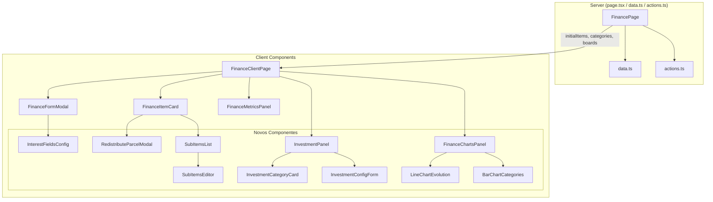
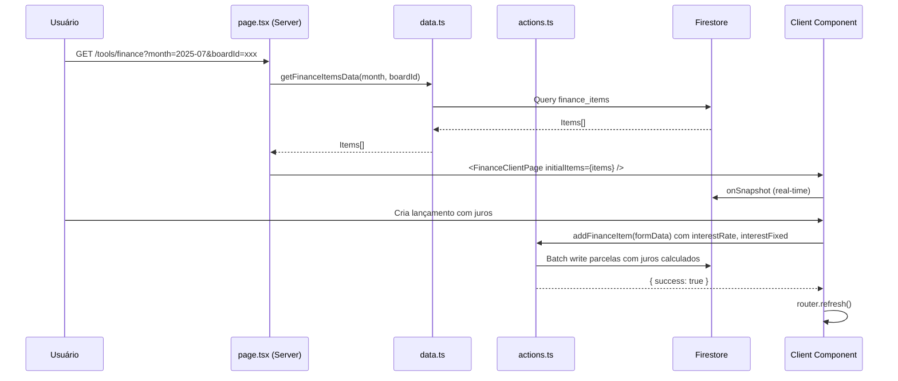
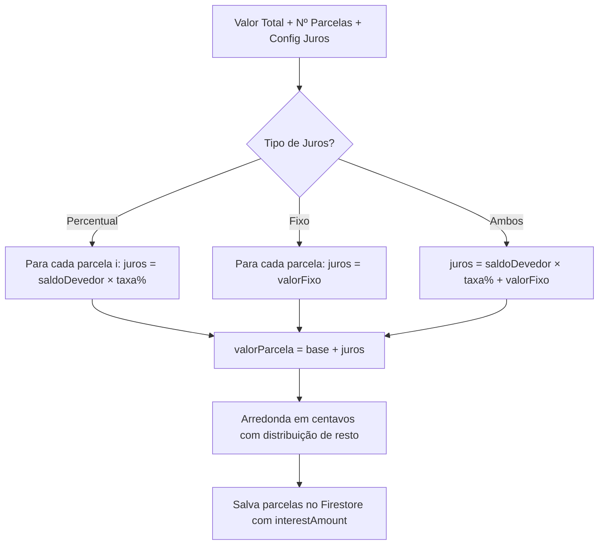

# Documento de Design — Funcionalidades Avançadas do Módulo Finance

## Visão Geral

Este documento descreve o design técnico para seis funcionalidades avançadas do módulo Finance: cálculo de juros, modal de redistribuição de parcelas, sub-itens em lançamentos, gestão de investimentos, gráficos de evolução financeira e melhorias de UX/responsividade. Todas as funcionalidades se integram à arquitetura existente (Next.js 15 App Router, Firebase, Tailwind CSS 4, next-intl) e respeitam os padrões de Server Components → Client Components, Server Actions com `{ error }` / `{ success: true }`, e CSS custom properties para theming.

### Decisões de Design Chave

1. **recharts** como biblioteca de gráficos — leve (~40kb gzip), React-friendly, responsiva, suporta `ResponsiveContainer`, tooltips e customização via props. Não requer dependências pesadas como D3 diretamente.
2. **Subcoleção Firestore** para sub-itens (`finance_items/{itemId}/sub_items`) — mantém queries de lançamentos leves e permite carregar sub-itens sob demanda.
3. **Investimentos como extensão do modelo existente** — reutiliza `finance_items` (type `expense`) e `finance_fixed_templates` com campo `investmentCategory`, evitando novas coleções desnecessárias.
4. **Configuração de investimentos por board** — nova coleção `finance_investment_configs` para armazenar proporções de alocação.
5. **Dados de gráficos carregados server-side** — Server Action dedicada busca dados de múltiplos meses e retorna agregados prontos para renderização.

---

## Arquitetura

### Diagrama de Componentes



### Fluxo de Dados



---

## Componentes e Interfaces

### Componentes Novos

| Componente | Tipo | Responsabilidade |
|---|---|---|
| `InterestFieldsConfig` | Client | Campos de configuração de juros no `FinanceFormModal` (taxa %, valor fixo) |
| `RedistributeParcelModal` | Client | Modal para redistribuir valores de parcelas de um grupo |
| `SubItemsEditor` | Client | Editor inline de sub-itens (adicionar, editar, remover) |
| `SubItemsList` | Client | Lista expansível de sub-itens dentro do `FinanceItemCard` |
| `InvestmentPanel` | Client | Painel principal de investimentos (resumo + cards de categoria + histórico) |
| `InvestmentCategoryCard` | Client | Card individual por categoria de investimento |
| `InvestmentConfigForm` | Client | Formulário para configurar proporções de alocação |
| `FinanceChartsPanel` | Client | Container dos gráficos com seletores de agrupamento |
| `LineChartEvolution` | Client | Gráfico de linha (receitas, despesas, saldo ao longo do tempo) |
| `BarChartCategories` | Client | Gráfico de barras empilhadas (despesas por categoria) |

### Componentes Atualizados

| Componente | Mudanças |
|---|---|
| `FinanceFormModal` | Adiciona seção de juros (`InterestFieldsConfig`) quando parcelamento está ativo; adiciona `SubItemsEditor` para sub-itens |
| `FinanceItemCard` | Adiciona indicador de sub-itens com expansão inline (`SubItemsList`); adiciona botão para abrir `RedistributeParcelModal` em itens parcelados |
| `FinanceClientPage` | Adiciona aba "Gráficos" e aba "Investimentos" ao seletor de abas existente; passa dados para novos painéis |
| `FinanceMetricsPanel` | Sem mudanças estruturais, mas recebe dados de investimentos para exibir resumo |

### Server Actions Novas

| Action | Descrição |
|---|---|
| `redistributeInstallments(groupId, newAmounts[], locale)` | Atualiza valores de parcelas pending em batch, validando soma = total original |
| `addSubItem(itemId, title, amount, locale)` | Adiciona sub-item à subcoleção |
| `updateSubItem(itemId, subItemId, title, amount, locale)` | Atualiza sub-item existente |
| `deleteSubItem(itemId, subItemId, locale)` | Remove sub-item |
| `getSubItems(itemId)` | Busca sub-itens de um lançamento (data fetching) |
| `saveInvestmentConfig(boardId, allocations, locale)` | Salva proporções de alocação |
| `getInvestmentConfig(boardId)` | Busca configuração de alocação |
| `getChartData(boardId, period, groupBy, locale)` | Busca dados agregados para gráficos |

### Server Actions Atualizadas

| Action | Mudanças |
|---|---|
| `addFinanceItem` | Aceita campos `interestType`, `interestRate`, `interestFixed`; calcula juros sobre parcelas quando presente |
| `deleteFinanceItem` | Quando item tem sub-itens, deleta subcoleção em batch |

---

## Modelos de Dados

### Tipos Novos

```typescript
// types/finance.ts — novos tipos

export type InterestType = "percentage" | "fixed" | "both";

export type InterestConfig = {
  type: InterestType;
  rate?: number;       // 0-100, percentual
  fixedAmount?: number; // valor fixo por parcela
};

export type SubItem = {
  id: string;
  title: string;
  amount: number;
  createdAt: string;
};

export type InvestmentCategory = "emergency" | "fixed-income" | "variable-income";

export type InvestmentAllocation = {
  category: InvestmentCategory;
  percentage: number; // 0-100
};

export type InvestmentConfig = {
  id: string;
  userId: string;
  boardId?: string;
  allocations: InvestmentAllocation[];
  updatedAt: string;
};

export type ChartGroupBy = "week" | "month" | "year";

export type ChartDataPoint = {
  label: string;       // "Jan 2025", "Sem 1", "2024"
  income: number;
  expense: number;
  balance: number;
};

export type CategoryChartDataPoint = {
  label: string;
  [category: string]: number | string; // valores por categoria
};
```

### Tipos Atualizados

```typescript
// FinanceItem — campos adicionais
export type FinanceItem = {
  // ... campos existentes ...

  // Juros (novos)
  interestConfig?: InterestConfig;
  interestAmount?: number; // valor de juros calculado para esta parcela

  // Investimento (novo)
  investmentCategory?: InvestmentCategory;
};
```

### Coleções Firestore

| Coleção / Subcoleção | Operação | Descrição |
|---|---|---|
| `finance_items/{itemId}/sub_items` | Nova subcoleção | Sub-itens de um lançamento. Campos: `title`, `amount`, `createdAt` |
| `finance_investment_configs` | Nova coleção | Configuração de alocação de investimentos por usuário/board. Campos: `userId`, `boardId?`, `allocations[]`, `updatedAt` |
| `finance_items` | Atualizada | Novos campos opcionais: `interestConfig`, `interestAmount`, `investmentCategory` |
| `finance_fixed_templates` | Atualizada | Novo campo opcional: `investmentCategory` |

### Constantes Novas

```typescript
// lib/finance/constants.ts — adições

export const INVESTMENT_CATEGORIES: InvestmentCategory[] = [
  "emergency",
  "fixed-income",
  "variable-income",
];

export const INVESTMENT_CATEGORY_LABELS: Record<InvestmentCategory, string> = {
  "emergency": "Reserva de Emergência",
  "fixed-income": "Renda Fixa",
  "variable-income": "Renda Variável",
};

// Labels reais virão do i18n, estas constantes servem como keys
export const INVESTMENT_CATEGORY_KEYS: Record<InvestmentCategory, string> = {
  "emergency": "investmentEmergency",
  "fixed-income": "investmentFixedIncome",
  "variable-income": "investmentVariableIncome",
};
```

### Cálculo de Juros — Algoritmo

Para um lançamento parcelado com juros:

1. **Juros percentual**: Para cada parcela `i` (1-indexed), o saldo devedor é `totalOriginal - somaParcelasAnteriores`. O juros da parcela é `saldoDevedor * (taxa / 100)`. O valor da parcela = `valorBaseParcela + jurosCalculado`.
2. **Juros fixo**: Cada parcela recebe `valorBaseParcela + valorFixo`.
3. **Ambos**: Aplica percentual primeiro sobre o saldo devedor, depois soma o fixo.
4. **Distribuição em centavos**: Após calcular juros, os valores são arredondados em centavos com distribuição de resto (mesmo padrão existente).
5. **Armazenamento**: Cada parcela salva `interestConfig` (referência à config do grupo) e `interestAmount` (juros calculado para aquela parcela específica).




---

## Propriedades de Corretude

*Uma propriedade é uma característica ou comportamento que deve ser verdadeiro em todas as execuções válidas de um sistema — essencialmente, uma declaração formal sobre o que o sistema deve fazer. Propriedades servem como ponte entre especificações legíveis por humanos e garantias de corretude verificáveis por máquina.*

### Propriedade 1: Cálculo de juros sobre parcelas preserva corretude

*Para qualquer* valor total positivo, número de parcelas (1-60), e configuração de juros (percentual 0-100, fixo ≥ 0, ou ambos), o cálculo de juros deve produzir parcelas onde: (a) juros percentual é calculado sobre o saldo devedor restante de cada parcela, (b) juros fixo é adicionado após o percentual, e (c) cada parcela armazena separadamente o valor base e o valor de juros.

**Validates: Requirements 1.2, 1.3, 1.4**

### Propriedade 2: Soma das parcelas com juros em centavos é precisa

*Para qualquer* valor total, número de parcelas e configuração de juros, a soma de todas as parcelas (valor base + juros) em centavos deve ser exatamente igual ao total esperado calculado, sem perda de centavos na distribuição.

**Validates: Requirements 1.7**

### Propriedade 3: Persistência round-trip da configuração de juros

*Para qualquer* configuração de juros válida (tipo, taxa, valor fixo), após salvar um grupo de parcelas com essa configuração e ler de volta do Firestore, os parâmetros de juros devem ser idênticos aos originais.

**Validates: Requirements 1.5**

### Propriedade 4: Diferença de redistribuição é correta em tempo real

*Para qualquer* grupo de parcelas com valor total original T e qualquer conjunto de valores editados V[], a diferença exibida deve ser exatamente T - soma(V[]), calculada em centavos para evitar erros de ponto flutuante.

**Validates: Requirements 2.2**

### Propriedade 5: Editabilidade de parcelas depende do status

*Para qualquer* parcela em um grupo, a parcela deve ser editável se e somente se seu status for "pending". Parcelas com status "paid", "partial" ou "moved" devem ser somente leitura.

**Validates: Requirements 2.3, 2.9**

### Propriedade 6: Redistribuição preserva o total original

*Para qualquer* grupo de parcelas com valor total original T e qualquer redistribuição de valores onde soma(novosValores) está dentro de 1 centavo de T, a operação deve ser aceita. Se a diferença exceder 1 centavo, a operação deve ser rejeitada.

**Validates: Requirements 2.5**

### Propriedade 7: Redistribuição preserva metadados de parcelas

*Para qualquer* operação de redistribuição bem-sucedida em um grupo de parcelas, os campos `installmentGroupId`, `installmentIndex`, `installmentTotal` e `originalAmount` de cada parcela devem permanecer inalterados antes e depois da operação.

**Validates: Requirements 2.8**

### Propriedade 8: Round-trip de redistribuição de parcelas

*Para qualquer* grupo de parcelas e qualquer redistribuição válida de valores, após salvar no Firestore e ler de volta, os valores de cada parcela devem ser iguais aos valores redistribuídos.

**Validates: Requirements 2.7**

### Propriedade 9: Persistência round-trip de sub-itens

*Para qualquer* sub-item com título não-vazio e valor positivo adicionado a um lançamento, ler a subcoleção `sub_items` do Firestore deve retornar um sub-item com título e valor idênticos ao original.

**Validates: Requirements 3.1**

### Propriedade 10: Editabilidade de sub-itens depende do status do lançamento pai

*Para qualquer* lançamento, operações de adicionar, editar e remover sub-itens devem ser permitidas se e somente se o status do lançamento for "pending". Para status "paid", "partial" ou "moved", as operações devem ser rejeitadas.

**Validates: Requirements 3.2**

### Propriedade 11: Soma de sub-itens e validação contra valor do lançamento

*Para qualquer* lançamento com valor V e qualquer conjunto de sub-itens, a soma dos sub-itens deve ser calculada corretamente, e o sistema deve aceitar quando soma ≤ V e exibir aviso quando soma > V.

**Validates: Requirements 3.4, 3.5**

### Propriedade 12: Exclusão em cascata de sub-itens

*Para qualquer* lançamento que possui sub-itens, após excluir o lançamento, a subcoleção `sub_items` associada deve estar vazia no Firestore.

**Validates: Requirements 3.7**

### Propriedade 13: Investimentos são registrados como despesas com subcategoria

*Para qualquer* categoria de investimento válida (emergency, fixed-income, variable-income) e qualquer boardId (ou sem board), ao criar um lançamento de investimento, o item resultante deve ter `type: "expense"` e `investmentCategory` igual à categoria selecionada, respeitando o escopo do board.

**Validates: Requirements 4.2, 4.10**

### Propriedade 14: Agregação de investimentos por categoria é correta

*Para qualquer* conjunto de lançamentos de investimento em um período (mês ou 12 meses), o total por categoria deve ser igual à soma dos valores de todos os lançamentos com aquela `investmentCategory` no período, excluindo itens com status "moved".

**Validates: Requirements 4.3, 4.8**

### Propriedade 15: Persistência round-trip de templates de investimento

*Para qualquer* template de investimento válido com `investmentCategory`, valor positivo e dia do mês, após salvar em `finance_fixed_templates` e ler de volta, todos os campos incluindo `investmentCategory` devem ser preservados.

**Validates: Requirements 4.4**

### Propriedade 16: Geração automática de aportes de investimento

*Para qualquer* template de investimento ativo com `investmentCategory`, ao processar um novo mês que ainda não possui o lançamento correspondente, o sistema deve gerar automaticamente um item com os mesmos dados do template, incluindo `investmentCategory`.

**Validates: Requirements 4.5**

### Propriedade 17: Sugestão de alocação respeita proporções configuradas

*Para qualquer* configuração de alocação onde as proporções somam 100% e qualquer valor total de investimento, os valores sugeridos por categoria devem ser proporcionais às porcentagens configuradas, com distribuição de centavos para manter precisão.

**Validates: Requirements 4.6, 4.7**

### Propriedade 18: Agregação de dados de gráficos por período é correta

*Para qualquer* conjunto de lançamentos e qualquer agrupamento (semana, mês, ano), os dados agregados devem ter: (a) receitas = soma dos itens type "income" no período, (b) despesas = soma dos itens type "expense" no período, (c) saldo = receitas - despesas, para cada ponto de dados.

**Validates: Requirements 5.1, 5.2, 5.3**

### Propriedade 19: Distribuição de despesas por categoria é correta

*Para qualquer* conjunto de lançamentos do tipo "expense" em um período, o gráfico de barras empilhadas deve mostrar totais por categoria que somam exatamente o total de despesas do período.

**Validates: Requirements 5.4**

### Propriedade 20: Dados de gráficos excluem itens "moved" e respeitam escopo de board

*Para qualquer* conjunto de lançamentos, os cálculos dos gráficos devem excluir todos os itens com status "moved", e quando um boardId é especificado, devem incluir apenas itens daquele board.

**Validates: Requirements 5.8, 5.9**

---

## Tratamento de Erros

### Validação de Entrada

| Cenário | Ação | Mensagem (i18n key) |
|---|---|---|
| Taxa de juros < 0 ou > 100 | Rejeitar formulário | `FinanceForm.errors.invalidInterestRate` |
| Valor fixo de juros < 0 | Rejeitar formulário | `FinanceForm.errors.invalidInterestFixed` |
| Soma de parcelas redistribuídas ≠ total original (> 1 centavo) | Impedir confirmação | `FinanceForm.errors.redistributionMismatch` |
| Editar parcela com status ≠ "pending" | Bloquear campo (UI) | N/A (campo desabilitado) |
| Valor de template de investimento ≤ 0 | Rejeitar formulário | `FinanceForm.errors.invalidInvestmentAmount` |
| Proporções de alocação não somam 100% | Rejeitar formulário | `FinanceForm.errors.allocationSumInvalid` |
| Sub-item com título vazio ou valor ≤ 0 | Rejeitar adição | `FinanceForm.errors.invalidSubItem` |
| Tentar editar sub-itens de item pago/movido | Rejeitar operação | `Finance.errors.cannotEditPaidItem` |

### Erros de Server Actions

Todas as Server Actions seguem o padrão existente:

```typescript
// Validação de sessão
const sessionUser = await getSession();
if (!sessionUser) return { error: t("errors.unauthorized") };

// Validação de permissão (board)
const board = await getBoard(boardId);
if (!board || !isMember(board, sessionUser)) return { error: t("errors.noPermission") };

// Validação de dados
if (!title.trim()) return { error: t("errors.incompleteData") };
```

### Erros de Carregamento de Gráficos

- Se a busca de dados falhar, exibir mensagem de erro inline no painel de gráficos com botão "Tentar novamente"
- Se não houver dados suficientes para gerar gráficos, exibir estado vazio com mensagem informativa
- Timeout de 10 segundos para busca de dados de gráficos (12 meses pode ser pesado)

### Erros de Sub-itens

- Se a subcoleção não puder ser lida, exibir mensagem de erro no card expandido
- Se a exclusão em cascata falhar parcialmente, logar erro e informar usuário

---

## Estratégia de Testes

### Abordagem Dual

Este projeto utiliza duas abordagens complementares de testes:

1. **Testes unitários**: Verificam exemplos específicos, edge cases e condições de erro
2. **Testes de propriedade (property-based)**: Verificam propriedades universais com inputs gerados aleatoriamente

Ambos são necessários para cobertura abrangente — testes unitários capturam bugs concretos, testes de propriedade verificam corretude geral.

### Biblioteca de Property-Based Testing

**fast-check** — biblioteca PBT para TypeScript/JavaScript, madura e bem mantida. Integra com qualquer test runner (Jest, Vitest).

### Configuração de Testes de Propriedade

- Mínimo de **100 iterações** por teste de propriedade
- Cada teste deve referenciar a propriedade do design com tag no formato:
  `// Feature: finance-advanced-features, Property {N}: {título}`
- Cada propriedade de corretude deve ser implementada por um **único** teste de propriedade

### Testes Unitários

Foco em:
- Exemplos específicos de cálculo de juros (valores conhecidos)
- Edge cases de validação (taxa = 0, taxa = 100, valor fixo = 0, 1 parcela)
- Integração entre componentes (formulário → action → Firestore)
- Condições de erro (sessão inválida, permissão negada, dados incompletos)
- Renderização de componentes com dados de investimento
- Estado vazio de gráficos

### Testes de Propriedade

Cada propriedade listada na seção "Propriedades de Corretude" deve ter um teste correspondente:

| Propriedade | Generators Necessários |
|---|---|
| 1-3 (Juros) | `fc.float({min: 0.01, max: 100000})` para valores, `fc.integer({min: 1, max: 60})` para parcelas, `fc.float({min: 0, max: 100})` para taxa |
| 4-8 (Redistribuição) | `fc.array(fc.float({min: 0.01, max: 10000}))` para valores de parcelas, `fc.constantFrom("pending", "paid", "moved")` para status |
| 9-12 (Sub-itens) | `fc.string({minLength: 1})` para títulos, `fc.float({min: 0.01, max: 100000})` para valores |
| 13-17 (Investimentos) | `fc.constantFrom("emergency", "fixed-income", "variable-income")` para categorias, `fc.float({min: 0, max: 100})` para percentuais |
| 18-20 (Gráficos) | Arrays de `FinanceItem` gerados com datas, tipos e status aleatórios |

### Estrutura de Arquivos de Teste

```
__tests__/
  finance/
    interest-calculation.test.ts      → Propriedades 1-3
    installment-redistribution.test.ts → Propriedades 4-8
    sub-items.test.ts                  → Propriedades 9-12
    investments.test.ts                → Propriedades 13-17
    chart-aggregation.test.ts          → Propriedades 18-20
```
