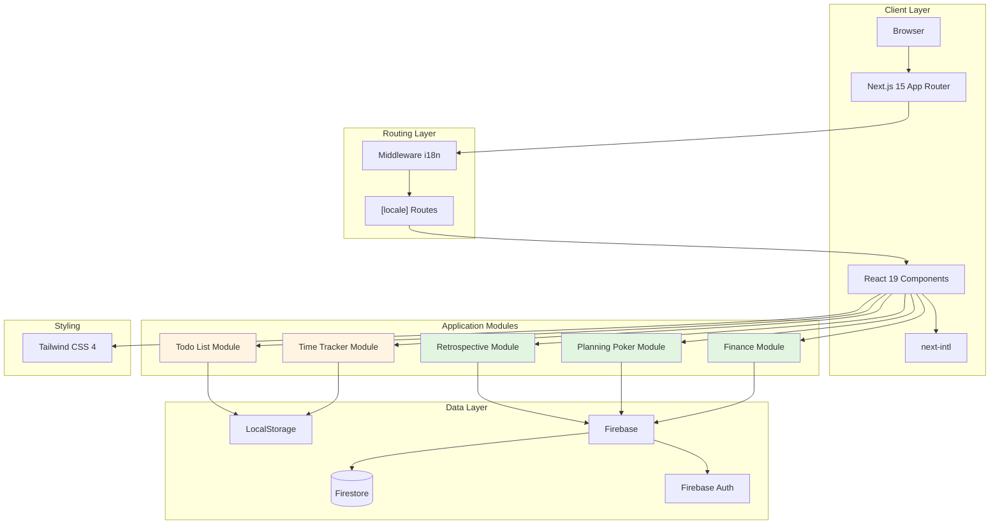
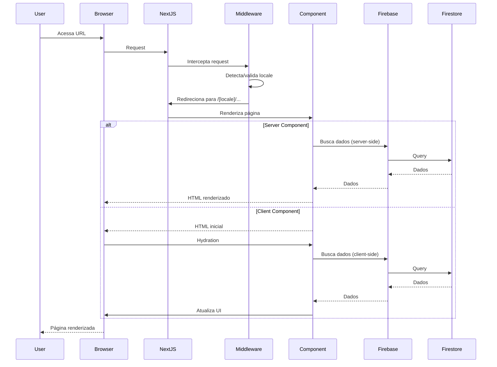
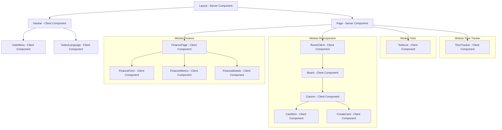
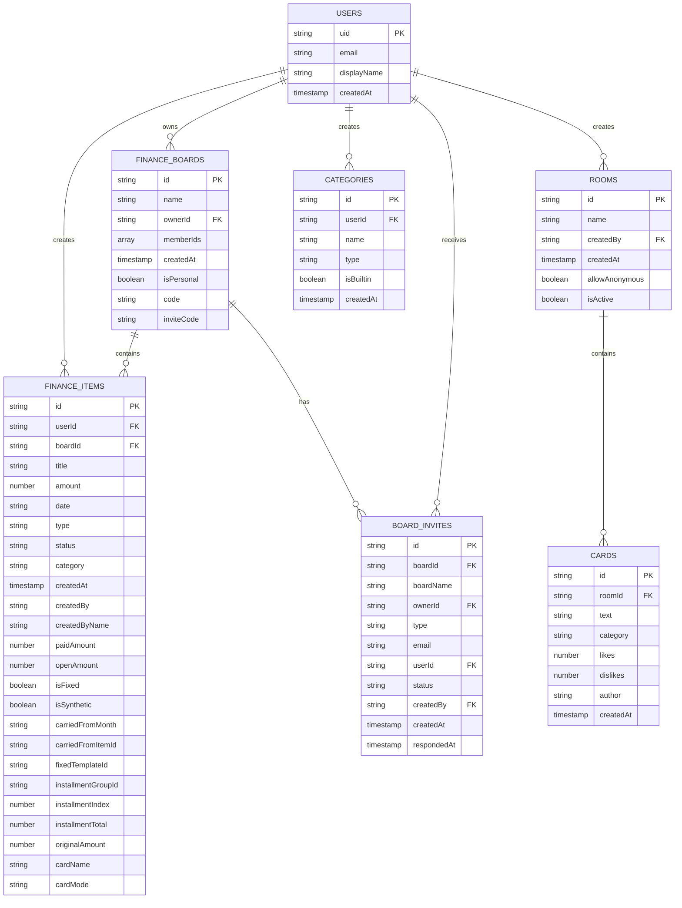

# Design Document: Documentação de Padrões e Boas Práticas do Retro-board

**Versão:** 0.8.2  
**Última Atualização:** 2025-01-XX  
**Status:** Em Desenvolvimento

## Overview

Este documento define o design da documentação estruturada de padrões e boas práticas para o projeto Retro-board. O objetivo é criar um sistema de documentação abrangente que sirva como referência única para desenvolvimento orientado a especificações (spec-driven development) usando o Kiro.

O Retro-board é uma aplicação web colaborativa construída com tecnologias modernas:
- **Frontend:** Next.js 15 (App Router), React 19, TypeScript
- **Styling:** Tailwind CSS 4
- **Backend:** Firebase (Firestore + Authentication)
- **Internacionalização:** next-intl (português, inglês, espanhol)
- **Hospedagem:** Vercel

A documentação será estruturada em múltiplos arquivos markdown organizados no diretório `/docs`, cobrindo desde padrões arquiteturais até exemplos práticos de implementação para cada módulo da aplicação.

### Objetivos da Documentação

1. **Consistência:** Garantir que todos os desenvolvedores sigam os mesmos padrões
2. **Onboarding:** Facilitar a integração de novos desenvolvedores ao projeto
3. **Spec-Driven Development:** Fornecer contexto rico para o Kiro auxiliar na criação de specs e implementações
4. **Manutenibilidade:** Documentar decisões arquiteturais e padrões estabelecidos
5. **Qualidade:** Estabelecer diretrizes claras para testes, acessibilidade e UX

## Architecture

### Estrutura de Documentação

A documentação será organizada em uma estrutura hierárquica no diretório `/docs`:

```
docs/
├── README.md                          # Índice principal e visão geral
├── architecture/
│   ├── overview.md                    # Arquitetura geral do sistema
│   ├── data-flow.md                   # Fluxo de dados cliente-servidor
│   └── firebase-structure.md          # Estrutura do Firestore e Auth
├── standards/
│   ├── project-structure.md           # Organização de pastas e arquivos
│   ├── naming-conventions.md          # Convenções de nomenclatura
│   ├── typescript-patterns.md         # Padrões TypeScript
│   └── component-patterns.md          # Padrões de componentes React
├── i18n/
│   ├── setup.md                       # Configuração do next-intl
│   ├── usage-guide.md                 # Como usar traduções
│   └── validation.md                  # Validação de completude
├── modules/
│   ├── retrospective.md               # Padrões do módulo Retrospectiva
│   ├── planning-poker.md              # Padrões do módulo Planning Poker
│   ├── todo.md                        # Padrões do módulo Todo List
│   ├── finance.md                     # Padrões do módulo Finance
│   └── time-tracker.md                # Padrões do módulo Time Tracker
├── design-system/
│   ├── colors.md                      # Paleta de cores
│   ├── typography.md                  # Tipografia e espaçamento
│   ├── components.md                  # Componentes reutilizáveis
│   └── accessibility.md               # Padrões de acessibilidade
├── development/
│   ├── build-process.md               # Processo de build e validação
│   ├── testing-guide.md               # Estratégia de testes
│   └── git-workflow.md                # Fluxo de trabalho Git
├── spec-driven/
│   ├── workflow.md                    # Fluxo de trabalho spec-driven
│   ├── templates/                     # Templates de specs
│   │   ├── feature-template.md
│   │   ├── bugfix-template.md
│   │   └── refactor-template.md
│   └── kiro-context.md                # Contexto do projeto para Kiro
└── dependencies/
    ├── overview.md                    # Visão geral das dependências
    └── configuration.md               # Configurações (Next.js, TS, Tailwind)
```

### Diagrama de Arquitetura Geral



### Fluxo de Dados



## Components and Interfaces

### Estrutura de Componentes

O projeto segue o padrão de organização do Next.js 15 App Router com separação clara entre Server Components e Client Components.

#### Hierarquia de Componentes



### Interfaces Principais

#### Internacionalização (I18n)

```typescript
// Interface para uso de traduções
interface TranslationHook {
  t: (key: string, values?: Record<string, any>) => string;
}

// Exemplo de uso
import { useTranslations } from 'next-intl';

function MyComponent() {
  const t = useTranslations('Namespace');
  return <h1>{t('title')}</h1>;
}
```

#### Firebase Authentication

```typescript
// Interface de usuário autenticado
interface AuthUser {
  uid: string;
  email: string | null;
  displayName: string | null;
  emailVerified: boolean;
}

// Interface de contexto de autenticação
interface AuthContextType {
  user: AuthUser | null;
  loading: boolean;
  signIn: (email: string, password: string) => Promise<void>;
  signUp: (email: string, password: string) => Promise<void>;
  signOut: () => Promise<void>;
}
```

#### Firestore Operations

```typescript
// Interface genérica para operações CRUD
interface FirestoreService<T> {
  create: (data: Omit<T, 'id'>) => Promise<string>;
  read: (id: string) => Promise<T | null>;
  update: (id: string, data: Partial<T>) => Promise<void>;
  delete: (id: string) => Promise<void>;
  query: (filters: QueryFilter[]) => Promise<T[]>;
}

// Interface de filtro de query
interface QueryFilter {
  field: string;
  operator: '==' | '!=' | '<' | '<=' | '>' | '>=' | 'in' | 'array-contains';
  value: any;
}
```

### Padrões de Componentes

#### Server Component (Padrão)

```typescript
// app/[locale]/example/page.tsx
import { getTranslations } from 'next-intl/server';

export default async function ExamplePage() {
  const t = await getTranslations('Example');
  
  // Pode fazer fetch de dados aqui diretamente
  // const data = await fetchData();
  
  return (
    <div>
      <h1>{t('title')}</h1>
      {/* Conteúdo */}
    </div>
  );
}
```

#### Client Component (com 'use client')

```typescript
// components/example/ExampleClient.tsx
'use client';

import { useState } from 'react';
import { useTranslations } from 'next-intl';

export default function ExampleClient() {
  const t = useTranslations('Example');
  const [state, setState] = useState('');
  
  return (
    <div>
      <h2>{t('subtitle')}</h2>
      <input 
        value={state}
        onChange={(e) => setState(e.target.value)}
      />
    </div>
  );
}
```

## Data Models

### Modelo de Dados do Firestore

O Firestore é organizado em coleções e documentos. Abaixo está a estrutura completa:



### Tipos TypeScript

#### Finance Module

```typescript
// types/finance.ts

export type FinanceStatus = "paid" | "pending" | "partial" | "moved";

export type FinanceItem = {
  id: string;
  userId: string;
  boardId?: string;
  
  // Dados principais
  title: string;
  amount: number;
  date: string; // "YYYY-MM-DD"
  type: "income" | "expense";
  status: FinanceStatus;
  category: string;
  createdAt: string;
  
  // Fixas / sintéticas
  isFixed?: boolean;
  isSynthetic?: boolean;
  
  // Quem lançou
  createdBy?: string;
  createdByName?: string;
  
  // Pagamentos parciais
  paidAmount?: number;
  openAmount?: number;
  
  // Contas carregadas
  carriedFromMonth?: string;
  carriedFromItemId?: string;
  
  // Parcelamento
  fixedTemplateId?: string;
  installmentGroupId?: string;
  installmentIndex?: number;
  installmentTotal?: number;
  originalAmount?: number;
  
  // Cartão
  cardName?: string;
  cardMode?: "credit" | "debit";
};

export type FinanceBoard = {
  id: string;
  name: string;
  ownerId: string;
  memberIds: string[];
  createdAt: string;
  isPersonal?: boolean;
  code?: string;
  inviteCode?: string;
};

export type FinanceBoardInviteStatus =
  | "pending"
  | "accepted"
  | "rejected"
  | "cancelled";

export type FinanceBoardInviteType = "email" | "code";

export type FinanceBoardInvite = {
  id: string;
  boardId: string;
  boardName: string;
  ownerId: string;
  type: FinanceBoardInviteType;
  email?: string;
  userId?: string;
  status: FinanceBoardInviteStatus;
  createdBy: string;
  createdAt: string;
  respondedAt?: string;
};
```

#### Retrospective Module

```typescript
// types/card.ts

export type Card = {
  id: string;
  text: string;
  category: "bom" | "ruim" | "melhorar";
  likes: number;
  dislikes: number;
  author?: string;
};

export const CATEGORY_COLORS: Record<Card["category"], string> = {
  bom: "bg-green-200",
  ruim: "bg-red-200",
  melhorar: "bg-yellow-200",
};

export const CATEGORIES = Object.keys(CATEGORY_COLORS) as Card["category"][];
```

#### Todo Module

```typescript
// types/todo.ts (implícito no código)

export type Todo = {
  id: string;
  text: string;
  completed: boolean;
  createdAt: string;
  dueDate?: string;
  dueTime?: string;
};
```

#### Time Tracker Module

```typescript
// types/time-tracker.ts (implícito no código)

export type PunchRecord = {
  id: string;
  timestamp: string; // ISO string
  type: 'in' | 'out';
};

export type WorkdayConfig = {
  workload: 6 | 8 | 8.8; // horas
  bankHours?: string; // "HH:MM"
  bankType?: 'positive' | 'negative';
};

export type WorkdaySummary = {
  worked: string; // "HH:MM"
  lunch: string; // "HH:MM"
  remaining: string; // "HH:MM"
  extra: string; // "HH:MM"
  suggestedExit: string; // "HH:MM"
};
```

### LocalStorage Data Models

Alguns módulos utilizam LocalStorage para persistência local:

```typescript
// Todo List
interface TodoStorage {
  todos: Todo[];
  lastUpdated: string;
}

// Time Tracker
interface TimeTrackerStorage {
  punches: PunchRecord[];
  config: WorkdayConfig;
  date: string; // "YYYY-MM-DD"
}
```


## Correctness Properties

*A property is a characteristic or behavior that should hold true across all valid executions of a system-essentially, a formal statement about what the system should do. Properties serve as the bridge between human-readable specifications and machine-verifiable correctness guarantees.*

### Property Reflection

Após análise dos 72 critérios de aceitação nos requisitos, identificamos que a maioria são requisitos sobre o **conteúdo da documentação** em si, não sobre comportamento testável do sistema. Dos critérios analisados:

- **68 critérios** são sobre o que a documentação deve conter (não testáveis automaticamente)
- **4 critérios** são potencialmente testáveis através de propriedades

Os critérios testáveis identificados foram:
1. Validação de completude de traduções (1.6)
2. Execução bem-sucedida do build (2.3)
3. Presença de data de atualização nos documentos (8.4)
4. Alinhamento de versionamento com package.json (8.5)

Após reflexão sobre redundância, mantemos as 4 propriedades pois cada uma valida um aspecto único e não redundante do sistema de documentação.

### Property 1: Completude de Traduções

*Para qualquer* chave presente em um arquivo de locale (pt.json, en.json ou es.json), essa mesma chave deve existir nos outros dois arquivos de locale.

**Validates: Requirements 1.6**

**Rationale:** Garante que não haja traduções faltantes que possam causar fallback para chaves não traduzidas na interface do usuário.

### Property 2: Build Bem-Sucedido

*Para qualquer* estado válido do código-fonte, executar `npm run build` deve completar com código de saída 0 (sucesso).

**Validates: Requirements 2.3**

**Rationale:** Garante que o código está em estado deployável e sem erros de compilação TypeScript ou build do Next.js.

### Property 3: Metadados de Atualização

*Para qualquer* arquivo de documentação markdown no diretório `/docs`, o arquivo deve conter um campo de data de última atualização no formato "YYYY-MM-DD" ou "YYYY-MM-XX" (para documentos em desenvolvimento).

**Validates: Requirements 8.4**

**Rationale:** Permite que desenvolvedores identifiquem rapidamente se a documentação está atualizada ou potencialmente desatualizada.

### Property 4: Versionamento Consistente

*Para qualquer* referência de versão na documentação, essa versão deve corresponder à versão definida no campo `version` do arquivo `package.json`.

**Validates: Requirements 8.5**

**Rationale:** Garante que a documentação está sincronizada com a versão atual do projeto, evitando confusão sobre qual versão está sendo documentada.

## Error Handling

### Estratégia de Tratamento de Erros

A documentação deve incluir padrões claros para tratamento de erros em diferentes contextos:

#### 1. Erros de Firebase

```typescript
// Padrão para operações Firestore
async function safeFirestoreOperation<T>(
  operation: () => Promise<T>,
  errorMessage: string
): Promise<T | null> {
  try {
    return await operation();
  } catch (error) {
    console.error(errorMessage, error);
    
    // Categorizar erro
    if (error.code === 'permission-denied') {
      throw new Error('Sem permissão para esta operação');
    } else if (error.code === 'not-found') {
      throw new Error('Recurso não encontrado');
    } else if (error.code === 'unavailable') {
      throw new Error('Serviço temporariamente indisponível');
    }
    
    throw new Error('Erro ao processar operação');
  }
}

// Exemplo de uso
const item = await safeFirestoreOperation(
  () => getDoc(doc(db, 'items', itemId)),
  'Erro ao buscar item'
);
```

#### 2. Erros de Autenticação

```typescript
// Padrão para erros de autenticação
function handleAuthError(error: any): string {
  const errorCode = error.code;
  
  switch (errorCode) {
    case 'auth/invalid-email':
      return 'Email inválido';
    case 'auth/user-disabled':
      return 'Usuário desabilitado';
    case 'auth/user-not-found':
    case 'auth/wrong-password':
      return 'Email ou senha inválidos';
    case 'auth/email-already-in-use':
      return 'Este email já está em uso';
    case 'auth/weak-password':
      return 'A senha deve ter pelo menos 6 caracteres';
    default:
      return 'Erro ao autenticar. Tente novamente.';
  }
}
```

#### 3. Erros de Validação de Formulários

```typescript
// Padrão para validação de formulários
interface ValidationResult {
  isValid: boolean;
  errors: Record<string, string>;
}

function validateFinanceForm(data: Partial<FinanceItem>): ValidationResult {
  const errors: Record<string, string> = {};
  
  if (!data.title?.trim()) {
    errors.title = 'Descrição é obrigatória';
  }
  
  if (!data.amount || data.amount <= 0) {
    errors.amount = 'Valor deve ser maior que zero';
  }
  
  if (!data.date) {
    errors.date = 'Data é obrigatória';
  }
  
  if (!data.category?.trim()) {
    errors.category = 'Categoria é obrigatória';
  }
  
  return {
    isValid: Object.keys(errors).length === 0,
    errors
  };
}
```

#### 4. Erros de Rede e Timeout

```typescript
// Padrão para operações com timeout
async function withTimeout<T>(
  promise: Promise<T>,
  timeoutMs: number = 10000
): Promise<T> {
  const timeoutPromise = new Promise<never>((_, reject) => {
    setTimeout(() => reject(new Error('Operação excedeu o tempo limite')), timeoutMs);
  });
  
  return Promise.race([promise, timeoutPromise]);
}

// Exemplo de uso
try {
  const data = await withTimeout(
    fetchDataFromFirebase(),
    5000
  );
} catch (error) {
  if (error.message.includes('tempo limite')) {
    // Mostrar mensagem de timeout
  }
}
```

#### 5. Feedback Visual de Erros

```typescript
// Padrão para componente de erro
interface ErrorDisplayProps {
  message: string;
  type?: 'error' | 'warning' | 'info';
  onDismiss?: () => void;
}

function ErrorDisplay({ message, type = 'error', onDismiss }: ErrorDisplayProps) {
  const bgColor = {
    error: 'bg-red-100 border-red-400 text-red-700',
    warning: 'bg-yellow-100 border-yellow-400 text-yellow-700',
    info: 'bg-blue-100 border-blue-400 text-blue-700'
  }[type];
  
  return (
    <div className={`border-l-4 p-4 ${bgColor}`} role="alert">
      <p>{message}</p>
      {onDismiss && (
        <button onClick={onDismiss} className="ml-4 underline">
          Dispensar
        </button>
      )}
    </div>
  );
}
```

### Logging e Monitoramento

```typescript
// Padrão para logging estruturado
interface LogEntry {
  level: 'info' | 'warn' | 'error';
  message: string;
  context?: Record<string, any>;
  timestamp: string;
  userId?: string;
}

function log(entry: Omit<LogEntry, 'timestamp'>): void {
  const logEntry: LogEntry = {
    ...entry,
    timestamp: new Date().toISOString()
  };
  
  // Em desenvolvimento, log no console
  if (process.env.NODE_ENV === 'development') {
    console[entry.level](logEntry);
  }
  
  // Em produção, enviar para serviço de monitoramento
  // (Firebase Analytics, Sentry, etc.)
}

// Exemplo de uso
log({
  level: 'error',
  message: 'Falha ao salvar item financeiro',
  context: {
    itemId: 'abc123',
    boardId: 'board456',
    errorCode: 'permission-denied'
  },
  userId: currentUser?.uid
});
```

## Testing Strategy

### Abordagem Dual de Testes

O projeto deve adotar uma estratégia de testes que combina:

1. **Testes Unitários:** Para casos específicos, edge cases e validações pontuais
2. **Testes de Propriedade:** Para validar propriedades universais através de múltiplas iterações

Ambos os tipos de teste são complementares e necessários para cobertura abrangente.

### Configuração de Testes

#### Ferramentas Recomendadas

Para um projeto Next.js com TypeScript, recomendamos:

- **Framework de Testes:** Jest ou Vitest
- **Testing Library:** React Testing Library
- **Property-Based Testing:** fast-check (JavaScript/TypeScript)
- **E2E Testing:** Playwright ou Cypress (opcional)

#### Instalação

```bash
# Vitest + React Testing Library
npm install -D vitest @testing-library/react @testing-library/jest-dom jsdom

# Property-based testing
npm install -D fast-check

# Configuração do Vitest
npm install -D @vitejs/plugin-react
```

#### Configuração do Vitest

```typescript
// vitest.config.ts
import { defineConfig } from 'vitest/config';
import react from '@vitejs/plugin-react';
import path from 'path';

export default defineConfig({
  plugins: [react()],
  test: {
    environment: 'jsdom',
    globals: true,
    setupFiles: ['./vitest.setup.ts'],
  },
  resolve: {
    alias: {
      '@': path.resolve(__dirname, './'),
    },
  },
});
```

```typescript
// vitest.setup.ts
import '@testing-library/jest-dom';
```

### Testes Unitários

#### Exemplo: Teste de Validação de Formulário

```typescript
// __tests__/finance/validation.test.ts
import { describe, it, expect } from 'vitest';
import { validateFinanceForm } from '@/lib/finance/validation';

describe('Finance Form Validation', () => {
  it('should reject empty title', () => {
    const result = validateFinanceForm({
      title: '',
      amount: 100,
      date: '2025-01-15',
      category: 'Food'
    });
    
    expect(result.isValid).toBe(false);
    expect(result.errors.title).toBeDefined();
  });
  
  it('should reject zero or negative amount', () => {
    const result = validateFinanceForm({
      title: 'Test',
      amount: 0,
      date: '2025-01-15',
      category: 'Food'
    });
    
    expect(result.isValid).toBe(false);
    expect(result.errors.amount).toBeDefined();
  });
  
  it('should accept valid data', () => {
    const result = validateFinanceForm({
      title: 'Grocery Shopping',
      amount: 150.50,
      date: '2025-01-15',
      category: 'Food',
      type: 'expense'
    });
    
    expect(result.isValid).toBe(true);
    expect(Object.keys(result.errors)).toHaveLength(0);
  });
});
```

#### Exemplo: Teste de Componente React

```typescript
// __tests__/components/TodoList.test.tsx
import { describe, it, expect, vi } from 'vitest';
import { render, screen, fireEvent } from '@testing-library/react';
import { NextIntlClientProvider } from 'next-intl';
import TodoList from '@/components/TodoList';

const messages = {
  TodoList: {
    title: 'Task List',
    placeholder: 'Task description',
    clearAll: 'Clear all',
    remaining: 'remaining',
    empty: 'No tasks yet...'
  }
};

describe('TodoList Component', () => {
  it('should render empty state', () => {
    render(
      <NextIntlClientProvider locale="en" messages={messages}>
        <TodoList />
      </NextIntlClientProvider>
    );
    
    expect(screen.getByText('No tasks yet...')).toBeInTheDocument();
  });
  
  it('should add a new task', () => {
    render(
      <NextIntlClientProvider locale="en" messages={messages}>
        <TodoList />
      </NextIntlClientProvider>
    );
    
    const input = screen.getByPlaceholderText('Task description');
    const addButton = screen.getByRole('button', { name: /add/i });
    
    fireEvent.change(input, { target: { value: 'New task' } });
    fireEvent.click(addButton);
    
    expect(screen.getByText('New task')).toBeInTheDocument();
  });
});
```

### Testes de Propriedade (Property-Based Testing)

#### Configuração Mínima

Cada teste de propriedade deve:
- Executar no mínimo **100 iterações**
- Incluir comentário com tag: `Feature: {feature_name}, Property {number}: {property_text}`
- Referenciar a propriedade correspondente no documento de design

#### Exemplo: Property Test para Completude de Traduções

```typescript
// __tests__/properties/i18n-completeness.property.test.ts
import { describe, it, expect } from 'vitest';
import fc from 'fast-check';
import pt from '@/locales/pt.json';
import en from '@/locales/en.json';
import es from '@/locales/es.json';

/**
 * Feature: project-standards-documentation, Property 1:
 * Para qualquer chave presente em um arquivo de locale,
 * essa mesma chave deve existir nos outros dois arquivos de locale.
 */
describe('I18n Completeness Property', () => {
  it('should have all keys present in all locale files', () => {
    fc.assert(
      fc.property(
        fc.constantFrom('pt', 'en', 'es'),
        (sourceLocale) => {
          const locales = { pt, en, es };
          const sourceKeys = getAllKeys(locales[sourceLocale]);
          
          // Verificar que todas as chaves existem nos outros locales
          const otherLocales = Object.keys(locales).filter(l => l !== sourceLocale);
          
          for (const locale of otherLocales) {
            const targetKeys = getAllKeys(locales[locale]);
            
            for (const key of sourceKeys) {
              expect(targetKeys).toContain(key);
            }
          }
        }
      ),
      { numRuns: 100 }
    );
  });
});

// Função auxiliar para extrair todas as chaves de um objeto aninhado
function getAllKeys(obj: any, prefix = ''): string[] {
  let keys: string[] = [];
  
  for (const key in obj) {
    const fullKey = prefix ? `${prefix}.${key}` : key;
    
    if (typeof obj[key] === 'object' && obj[key] !== null) {
      keys = keys.concat(getAllKeys(obj[key], fullKey));
    } else {
      keys.push(fullKey);
    }
  }
  
  return keys;
}
```

#### Exemplo: Property Test para Versionamento

```typescript
// __tests__/properties/version-consistency.property.test.ts
import { describe, it, expect } from 'vitest';
import fc from 'fast-check';
import fs from 'fs';
import path from 'path';
import packageJson from '@/package.json';

/**
 * Feature: project-standards-documentation, Property 4:
 * Para qualquer referência de versão na documentação,
 * essa versão deve corresponder à versão definida no package.json.
 */
describe('Version Consistency Property', () => {
  it('should have consistent version across documentation', () => {
    const docsDir = path.join(process.cwd(), 'docs');
    const expectedVersion = packageJson.version;
    
    // Encontrar todos os arquivos markdown
    const mdFiles = findMarkdownFiles(docsDir);
    
    fc.assert(
      fc.property(
        fc.constantFrom(...mdFiles),
        (filePath) => {
          const content = fs.readFileSync(filePath, 'utf-8');
          
          // Procurar por padrões de versão (ex: "Versão: 0.8.2", "v0.8.2", etc.)
          const versionPattern = /(?:versão|version|v)[\s:]*(\d+\.\d+\.\d+)/gi;
          const matches = content.matchAll(versionPattern);
          
          for (const match of matches) {
            const foundVersion = match[1];
            expect(foundVersion).toBe(expectedVersion);
          }
        }
      ),
      { numRuns: 100 }
    );
  });
});

function findMarkdownFiles(dir: string): string[] {
  let files: string[] = [];
  
  if (!fs.existsSync(dir)) return files;
  
  const entries = fs.readdirSync(dir, { withFileTypes: true });
  
  for (const entry of entries) {
    const fullPath = path.join(dir, entry.name);
    
    if (entry.isDirectory()) {
      files = files.concat(findMarkdownFiles(fullPath));
    } else if (entry.isFile() && entry.name.endsWith('.md')) {
      files.push(fullPath);
    }
  }
  
  return files;
}
```

#### Exemplo: Property Test para Cálculos Financeiros

```typescript
// __tests__/properties/finance-calculations.property.test.ts
import { describe, it, expect } from 'vitest';
import fc from 'fast-check';
import { calculateBalance, calculateOverdue } from '@/lib/finance/calculations';

/**
 * Property: Balance calculation should be commutative
 * (order of items should not affect final balance)
 */
describe('Finance Calculations Properties', () => {
  it('balance calculation should be order-independent', () => {
    fc.assert(
      fc.property(
        fc.array(
          fc.record({
            amount: fc.float({ min: 0.01, max: 10000, noNaN: true }),
            type: fc.constantFrom('income', 'expense'),
            status: fc.constantFrom('paid', 'pending')
          }),
          { minLength: 1, maxLength: 50 }
        ),
        (items) => {
          // Calcular balance com ordem original
          const balance1 = calculateBalance(items);
          
          // Calcular balance com ordem invertida
          const balance2 = calculateBalance([...items].reverse());
          
          // Calcular balance com ordem aleatória
          const shuffled = [...items].sort(() => Math.random() - 0.5);
          const balance3 = calculateBalance(shuffled);
          
          // Todos devem ser iguais
          expect(balance1).toBeCloseTo(balance2, 2);
          expect(balance1).toBeCloseTo(balance3, 2);
        }
      ),
      { numRuns: 100 }
    );
  });
  
  it('adding income should increase balance', () => {
    fc.assert(
      fc.property(
        fc.array(
          fc.record({
            amount: fc.float({ min: 0.01, max: 10000, noNaN: true }),
            type: fc.constantFrom('income', 'expense'),
            status: fc.constantFrom('paid', 'pending')
          })
        ),
        fc.float({ min: 0.01, max: 1000, noNaN: true }),
        (items, newIncomeAmount) => {
          const balanceBefore = calculateBalance(items);
          
          const newIncome = {
            amount: newIncomeAmount,
            type: 'income' as const,
            status: 'paid' as const
          };
          
          const balanceAfter = calculateBalance([...items, newIncome]);
          
          expect(balanceAfter).toBeGreaterThan(balanceBefore);
          expect(balanceAfter - balanceBefore).toBeCloseTo(newIncomeAmount, 2);
        }
      ),
      { numRuns: 100 }
    );
  });
});
```

### Cobertura de Testes

#### Metas de Cobertura

- **Funções utilitárias:** 90%+ de cobertura
- **Componentes críticos:** 80%+ de cobertura
- **Lógica de negócio:** 85%+ de cobertura
- **Componentes de UI simples:** 60%+ de cobertura

#### Executar Testes com Cobertura

```bash
# Executar todos os testes
npm run test

# Executar com cobertura
npm run test:coverage

# Executar em modo watch
npm run test:watch
```

#### Configuração no package.json

```json
{
  "scripts": {
    "test": "vitest run",
    "test:watch": "vitest",
    "test:coverage": "vitest run --coverage"
  }
}
```

### Integração com CI/CD

Os testes devem ser executados automaticamente em:

1. **Pre-commit hook:** Testes unitários rápidos
2. **Pull Request:** Todos os testes + cobertura
3. **Deploy:** Build + testes antes de deploy na Vercel

```yaml
# .github/workflows/test.yml
name: Tests

on: [push, pull_request]

jobs:
  test:
    runs-on: ubuntu-latest
    
    steps:
      - uses: actions/checkout@v3
      
      - name: Setup Node.js
        uses: actions/setup-node@v3
        with:
          node-version: '20'
          
      - name: Install dependencies
        run: npm ci
        
      - name: Run tests
        run: npm run test:coverage
        
      - name: Upload coverage
        uses: codecov/codecov-action@v3
```

---

## Anexo: Exemplos de Código por Módulo

### Módulo Finance

#### Criar um Novo Lançamento

```typescript
// lib/finance/create-item.ts
import { collection, addDoc, serverTimestamp } from 'firebase/firestore';
import { db } from '@/lib/firebase';
import type { FinanceItem } from '@/types/finance';

export async function createFinanceItem(
  userId: string,
  boardId: string,
  data: Omit<FinanceItem, 'id' | 'userId' | 'boardId' | 'createdAt'>
): Promise<string> {
  const itemData = {
    ...data,
    userId,
    boardId,
    createdAt: serverTimestamp(),
    status: data.status || 'pending',
  };
  
  const docRef = await addDoc(collection(db, 'financeItems'), itemData);
  return docRef.id;
}
```

#### Buscar Lançamentos de um Mês

```typescript
// lib/finance/query-items.ts
import { collection, query, where, getDocs } from 'firebase/firestore';
import { db } from '@/lib/firebase';
import type { FinanceItem } from '@/types/finance';

export async function getItemsByMonth(
  boardId: string,
  year: number,
  month: number
): Promise<FinanceItem[]> {
  const startDate = `${year}-${String(month).padStart(2, '0')}-01`;
  const endDate = `${year}-${String(month).padStart(2, '0')}-31`;
  
  const q = query(
    collection(db, 'financeItems'),
    where('boardId', '==', boardId),
    where('date', '>=', startDate),
    where('date', '<=', endDate)
  );
  
  const snapshot = await getDocs(q);
  
  return snapshot.docs.map(doc => ({
    id: doc.id,
    ...doc.data()
  })) as FinanceItem[];
}
```

### Módulo Retrospective

#### Criar um Card

```typescript
// lib/retrospective/create-card.ts
import { collection, addDoc, serverTimestamp } from 'firebase/firestore';
import { db } from '@/lib/firebase';
import type { Card } from '@/types/card';

export async function createCard(
  roomId: string,
  text: string,
  category: Card['category'],
  author?: string
): Promise<string> {
  const cardData = {
    roomId,
    text,
    category,
    author: author || 'Anônimo',
    likes: 0,
    dislikes: 0,
    createdAt: serverTimestamp(),
  };
  
  const docRef = await addDoc(collection(db, 'cards'), cardData);
  return docRef.id;
}
```

#### Votar em um Card

```typescript
// lib/retrospective/vote-card.ts
import { doc, updateDoc, increment } from 'firebase/firestore';
import { db } from '@/lib/firebase';

export async function voteCard(
  cardId: string,
  voteType: 'like' | 'dislike'
): Promise<void> {
  const cardRef = doc(db, 'cards', cardId);
  
  await updateDoc(cardRef, {
    [voteType === 'like' ? 'likes' : 'dislikes']: increment(1)
  });
}
```

### Módulo Todo (LocalStorage)

#### Gerenciar Todos

```typescript
// hooks/useTodos.ts
import { useState, useEffect } from 'react';
import type { Todo } from '@/types/todo';

const STORAGE_KEY = 'retro-board-todos';

export function useTodos() {
  const [todos, setTodos] = useState<Todo[]>([]);
  
  // Carregar do LocalStorage
  useEffect(() => {
    const stored = localStorage.getItem(STORAGE_KEY);
    if (stored) {
      setTodos(JSON.parse(stored));
    }
  }, []);
  
  // Salvar no LocalStorage
  useEffect(() => {
    localStorage.setItem(STORAGE_KEY, JSON.stringify(todos));
  }, [todos]);
  
  const addTodo = (text: string) => {
    const newTodo: Todo = {
      id: crypto.randomUUID(),
      text,
      completed: false,
      createdAt: new Date().toISOString(),
    };
    setTodos(prev => [...prev, newTodo]);
  };
  
  const toggleTodo = (id: string) => {
    setTodos(prev =>
      prev.map(todo =>
        todo.id === id ? { ...todo, completed: !todo.completed } : todo
      )
    );
  };
  
  const deleteTodo = (id: string) => {
    setTodos(prev => prev.filter(todo => todo.id !== id));
  };
  
  const clearAll = () => {
    setTodos([]);
  };
  
  return {
    todos,
    addTodo,
    toggleTodo,
    deleteTodo,
    clearAll,
  };
}
```

### Internacionalização

#### Uso em Server Component

```typescript
// app/[locale]/example/page.tsx
import { getTranslations } from 'next-intl/server';

export default async function ExamplePage() {
  const t = await getTranslations('Example');
  
  return (
    <div>
      <h1>{t('title')}</h1>
      <p>{t('description')}</p>
    </div>
  );
}
```

#### Uso em Client Component

```typescript
// components/example/ExampleClient.tsx
'use client';

import { useTranslations } from 'next-intl';

export default function ExampleClient() {
  const t = useTranslations('Example');
  
  return (
    <div>
      <h2>{t('subtitle')}</h2>
      <button>{t('action')}</button>
    </div>
  );
}
```

#### Traduções com Parâmetros

```typescript
// Arquivo de locale (pt.json)
{
  "Finance": {
    "launchedBy": "Lançado por {name}",
    "openAmount": "Saldo em aberto: {value}"
  }
}

// Uso no componente
const t = useTranslations('Finance');

<p>{t('launchedBy', { name: 'João' })}</p>
// Resultado: "Lançado por João"

<p>{t('openAmount', { value: 'R$ 150,00' })}</p>
// Resultado: "Saldo em aberto: R$ 150,00"
```

---

**Fim do Documento de Design**

