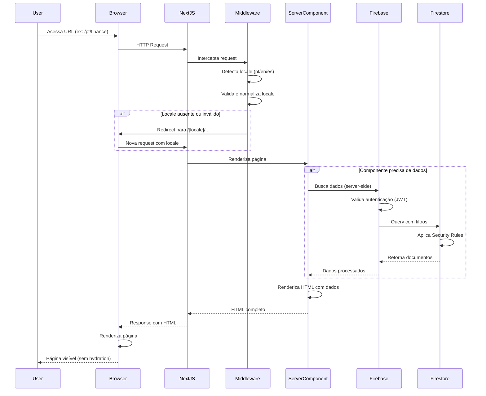
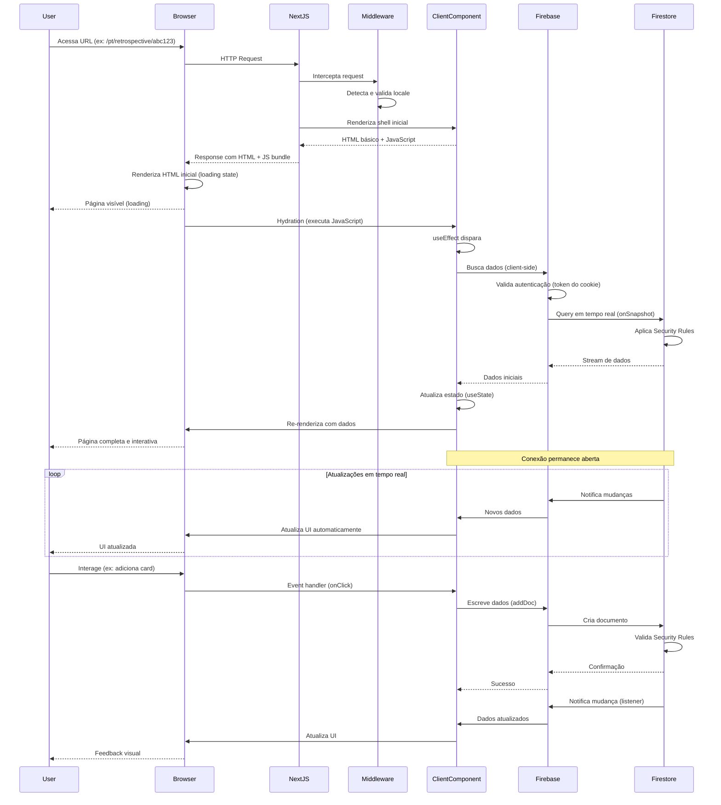
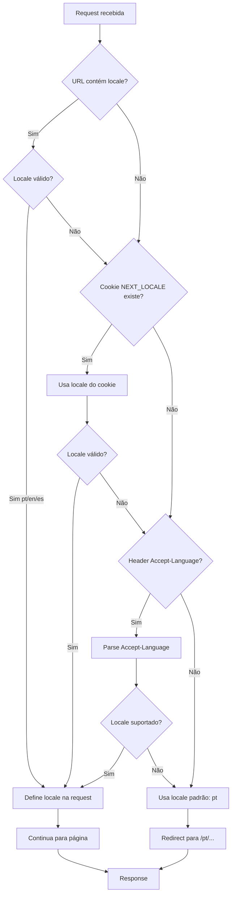
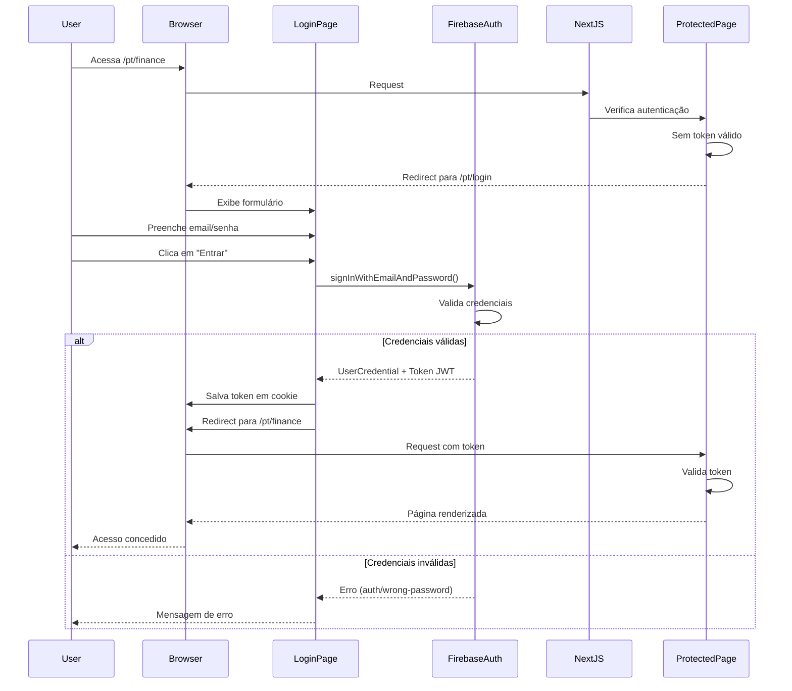
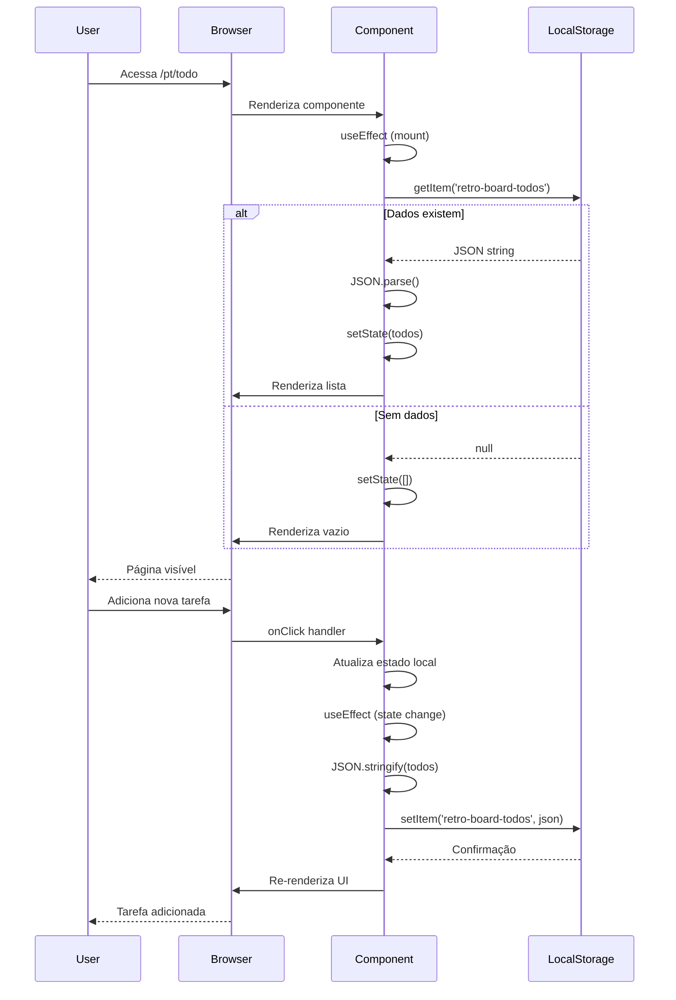

# Fluxo de Dados

**Versão:** 0.8.2  
**Última Atualização:** 2025-01-30  
**Status:** Ativo

## Visão Geral

Este documento descreve como os dados fluem através da aplicação Retro-board, desde a requisição do usuário até a resposta final. A aplicação utiliza uma arquitetura híbrida com Next.js 15, combinando Server Components e Client Components, cada um com seu próprio padrão de fluxo de dados.

Entender esses fluxos é essencial para:
- Decidir quando usar Server Components vs Client Components
- Otimizar performance e experiência do usuário
- Implementar funcionalidades de forma consistente
- Debugar problemas de dados e renderização

## Conceitos Fundamentais

### Server Components vs Client Components

#### Server Components (Padrão)
- **Renderização:** Executados no servidor durante o build ou a cada requisição
- **Bundle JavaScript:** Não adicionam JavaScript ao bundle do cliente
- **Acesso a dados:** Podem acessar diretamente APIs, bancos de dados e sistema de arquivos
- **Limitações:** Não podem usar hooks (`useState`, `useEffect`) ou event handlers
- **Quando usar:** Páginas estáticas, componentes sem interatividade, queries pesadas

#### Client Components
- **Renderização:** Executados no navegador após hydration
- **Bundle JavaScript:** Adicionam JavaScript ao bundle do cliente
- **Acesso a dados:** Fazem requisições via APIs do navegador (fetch, Firebase SDK)
- **Capacidades:** Podem usar hooks, estado local e event handlers
- **Marcação:** Requerem diretiva `'use client'` no topo do arquivo
- **Quando usar:** Formulários, interatividade, estado local, real-time updates


## Fluxo de Dados com Server Components

Server Components são o padrão no Next.js 15 App Router. Eles são renderizados no servidor e enviam HTML pronto para o navegador.

### Diagrama de Sequência



### Características do Fluxo

1. **Execução no Servidor:** Todo o código do componente roda no servidor
2. **Sem JavaScript no Cliente:** O componente não adiciona JavaScript ao bundle
3. **HTML Completo:** O navegador recebe HTML já renderizado com dados
4. **SEO Otimizado:** Crawlers veem conteúdo completo
5. **Performance:** Primeira renderização rápida (FCP baixo)


### Exemplo Prático: Página de Finance (Server Component)

```typescript
// app/[locale]/finance/page.tsx
import { getTranslations } from 'next-intl/server';
import { getServerSession } from 'next-auth/next';
import { collection, query, where, getDocs } from 'firebase/firestore';
import { db } from '@/lib/firebase-admin'; // SDK admin para server-side

export default async function FinancePage() {
  // 1. Buscar traduções (server-side)
  const t = await getTranslations('Finance');
  
  // 2. Verificar autenticação (server-side)
  const session = await getServerSession();
  
  if (!session) {
    redirect('/login');
  }
  
  // 3. Buscar dados do Firestore (server-side)
  const boardsQuery = query(
    collection(db, 'financeBoards'),
    where('ownerId', '==', session.user.uid)
  );
  
  const snapshot = await getDocs(boardsQuery);
  const boards = snapshot.docs.map(doc => ({
    id: doc.id,
    ...doc.data()
  }));
  
  // 4. Renderizar com dados
  return (
    <div>
      <h1>{t('title')}</h1>
      <p>{t('welcome', { name: session.user.name })}</p>
      
      <div>
        {boards.map(board => (
          <div key={board.id}>
            <h2>{board.name}</h2>
            <p>{t('members', { count: board.memberIds.length })}</p>
          </div>
        ))}
      </div>
    </div>
  );
}
```

### Requisição e Resposta

**Request:**
```http
GET /pt/finance HTTP/1.1
Host: retro-board.vercel.app
Cookie: next-auth.session-token=eyJhbGc...
Accept-Language: pt-BR,pt;q=0.9
```

**Response:**
```http
HTTP/1.1 200 OK
Content-Type: text/html; charset=utf-8

<!DOCTYPE html>
<html lang="pt">
<head>
  <title>Finanças - Retro Board</title>
</head>
<body>
  <div>
    <h1>Finanças</h1>
    <p>Bem-vindo, João Silva</p>
    <div>
      <div>
        <h2>Pessoal</h2>
        <p>1 membro</p>
      </div>
      <div>
        <h2>Família</h2>
        <p>3 membros</p>
      </div>
    </div>
  </div>
</body>
</html>
```

**Observações:**
- HTML completo com dados já renderizados
- Sem necessidade de JavaScript para exibir conteúdo
- Dados buscados no servidor (não expostos ao cliente)
- Traduções aplicadas no servidor


## Fluxo de Dados com Client Components

Client Components são renderizados no navegador e permitem interatividade completa. Eles fazem requisições de dados após a hydration.

### Diagrama de Sequência



### Características do Fluxo

1. **Renderização Inicial:** HTML básico enviado rapidamente (shell)
2. **Hydration:** JavaScript executa no navegador e "ativa" o componente
3. **Busca de Dados:** Feita no cliente após hydration
4. **Tempo Real:** Listeners mantêm conexão aberta com Firestore
5. **Interatividade:** Event handlers respondem a ações do usuário
6. **Bundle JavaScript:** Componente adiciona código ao bundle do cliente


### Exemplo Prático: Sala de Retrospectiva (Client Component)

```typescript
// app/[locale]/retrospective/[roomId]/RoomClient.tsx
'use client';

import { useState, useEffect } from 'react';
import { useTranslations } from 'next-intl';
import { collection, query, where, onSnapshot, addDoc } from 'firebase/firestore';
import { db } from '@/lib/firebase'; // SDK client para client-side
import type { Card } from '@/types/card';

interface RoomClientProps {
  roomId: string;
}

export default function RoomClient({ roomId }: RoomClientProps) {
  const t = useTranslations('Retrospective');
  
  // 1. Estado local
  const [cards, setCards] = useState<Card[]>([]);
  const [loading, setLoading] = useState(true);
  const [newCardText, setNewCardText] = useState('');
  
  // 2. Buscar dados em tempo real (client-side)
  useEffect(() => {
    const q = query(
      collection(db, 'cards'),
      where('roomId', '==', roomId)
    );
    
    // Listener em tempo real
    const unsubscribe = onSnapshot(q, (snapshot) => {
      const cardsData = snapshot.docs.map(doc => ({
        id: doc.id,
        ...doc.data()
      })) as Card[];
      
      setCards(cardsData);
      setLoading(false);
    });
    
    // Cleanup ao desmontar
    return () => unsubscribe();
  }, [roomId]);
  
  // 3. Handler de interação
  const handleAddCard = async (category: Card['category']) => {
    if (!newCardText.trim()) return;
    
    await addDoc(collection(db, 'cards'), {
      roomId,
      text: newCardText,
      category,
      likes: 0,
      dislikes: 0,
      author: 'Anônimo',
      createdAt: new Date().toISOString()
    });
    
    setNewCardText('');
  };
  
  // 4. Renderização com estado
  if (loading) {
    return <div>{t('loading')}</div>;
  }
  
  return (
    <div>
      <h1>{t('room')}</h1>
      
      {/* Formulário interativo */}
      <div>
        <input
          value={newCardText}
          onChange={(e) => setNewCardText(e.target.value)}
          placeholder={t('cardPlaceholder')}
        />
        <button onClick={() => handleAddCard('bom')}>
          {t('addGood')}
        </button>
        <button onClick={() => handleAddCard('ruim')}>
          {t('addBad')}
        </button>
        <button onClick={() => handleAddCard('melhorar')}>
          {t('addImprove')}
        </button>
      </div>
      
      {/* Lista de cards */}
      <div>
        {cards.map(card => (
          <div key={card.id}>
            <p>{card.text}</p>
            <span>{card.likes} 👍</span>
            <span>{card.dislikes} 👎</span>
          </div>
        ))}
      </div>
    </div>
  );
}
```

### Requisição e Resposta

**Request Inicial:**
```http
GET /pt/retrospective/abc123 HTTP/1.1
Host: retro-board.vercel.app
Accept-Language: pt-BR,pt;q=0.9
```

**Response Inicial (HTML Shell):**
```http
HTTP/1.1 200 OK
Content-Type: text/html; charset=utf-8

<!DOCTYPE html>
<html lang="pt">
<head>
  <title>Retrospectiva - Retro Board</title>
  <script src="/_next/static/chunks/app-abc123.js" defer></script>
</head>
<body>
  <div id="__next">
    <div>Carregando...</div>
  </div>
</body>
</html>
```

**Após Hydration (Requisição ao Firestore via WebSocket):**
```javascript
// Requisição WebSocket ao Firestore
{
  "database": "projects/retro-board/databases/(default)",
  "addTarget": {
    "query": {
      "parent": "projects/retro-board/databases/(default)/documents",
      "structuredQuery": {
        "from": [{ "collectionId": "cards" }],
        "where": {
          "fieldFilter": {
            "field": { "fieldPath": "roomId" },
            "op": "EQUAL",
            "value": { "stringValue": "abc123" }
          }
        }
      }
    },
    "targetId": 2
  }
}
```

**Response do Firestore (Stream):**
```javascript
// Dados iniciais
{
  "targetChange": {
    "targetChangeType": "ADD",
    "targetIds": [2]
  }
}

{
  "documentChange": {
    "document": {
      "name": "projects/retro-board/databases/(default)/documents/cards/card1",
      "fields": {
        "roomId": { "stringValue": "abc123" },
        "text": { "stringValue": "Ótima sprint!" },
        "category": { "stringValue": "bom" },
        "likes": { "integerValue": "5" },
        "dislikes": { "integerValue": "0" }
      }
    },
    "targetIds": [2]
  }
}

// Mais documentos...
```

**Observações:**
- HTML inicial é mínimo (loading state)
- JavaScript bundle é carregado e executado
- Dados são buscados após hydration via WebSocket
- Conexão permanece aberta para atualizações em tempo real
- Interações do usuário disparam requisições ao Firestore


## Comparação: Server vs Client Components

### Tabela Comparativa

| Aspecto | Server Component | Client Component |
|---------|------------------|------------------|
| **Renderização inicial** | Servidor (HTML completo) | Servidor (HTML shell) + Cliente (hydration) |
| **Bundle JavaScript** | Não adiciona ao bundle | Adiciona ao bundle |
| **Busca de dados** | Server-side (antes de renderizar) | Client-side (após hydration) |
| **Tempo de carregamento** | FCP rápido, conteúdo imediato | FCP rápido, conteúdo após hydration |
| **SEO** | Excelente (HTML completo) | Bom (HTML shell, conteúdo após JS) |
| **Interatividade** | Nenhuma | Completa (hooks, event handlers) |
| **Tempo real** | Não suportado | Suportado (listeners) |
| **Acesso a APIs** | Direto (Node.js APIs) | Navegador (fetch, Firebase SDK) |
| **Segurança** | Credenciais no servidor | Credenciais expostas ao cliente |
| **Quando usar** | Páginas estáticas, conteúdo sem interação | Formulários, dashboards, tempo real |

### Exemplo de Decisão

#### ✅ Use Server Component quando:
- Página de listagem de boards (apenas visualização)
- Página de documentação ou FAQ
- Landing page ou página institucional
- Relatórios estáticos
- Conteúdo que não muda frequentemente

#### ✅ Use Client Component quando:
- Formulário de criação/edição
- Dashboard com gráficos interativos
- Chat ou colaboração em tempo real
- Componentes com estado local (modais, dropdowns)
- Componentes que usam APIs do navegador (geolocation, localStorage)


## Fluxo de Middleware (Internacionalização)

O middleware intercepta todas as requisições para gerenciar a internacionalização.

### Diagrama de Fluxo



### Exemplo de Código do Middleware

```typescript
// middleware.ts
import createMiddleware from 'next-intl/middleware';

export default createMiddleware({
  // Locales suportados
  locales: ['pt', 'en', 'es'],
  
  // Locale padrão
  defaultLocale: 'pt',
  
  // Estratégia de detecção
  localeDetection: true,
  
  // Prefixo sempre presente na URL
  localePrefix: 'always'
});

export const config = {
  // Matcher: aplica middleware a todas as rotas exceto assets
  matcher: ['/((?!api|_next|_vercel|.*\\..*).*)']
};
```

### Exemplos de Redirecionamento

**Cenário 1: URL sem locale**
```
Request:  GET /finance
Response: 302 Redirect
Location: /pt/finance
```

**Cenário 2: Locale inválido**
```
Request:  GET /fr/finance
Response: 302 Redirect
Location: /pt/finance
```

**Cenário 3: Locale válido**
```
Request:  GET /en/finance
Response: 200 OK (continua para página)
```

**Cenário 4: Cookie com preferência**
```
Request:  GET /finance
Cookie:   NEXT_LOCALE=es
Response: 302 Redirect
Location: /es/finance
```


## Fluxo de Autenticação

A autenticação é gerenciada pelo Firebase Auth e integrada com Next.js.

### Diagrama de Fluxo de Login



### Exemplo de Código de Autenticação

```typescript
// app/[locale]/login/LoginForm.tsx
'use client';

import { useState } from 'react';
import { useRouter } from 'next/navigation';
import { signInWithEmailAndPassword } from 'firebase/auth';
import { auth } from '@/lib/firebase';

export default function LoginForm() {
  const router = useRouter();
  const [email, setEmail] = useState('');
  const [password, setPassword] = useState('');
  const [error, setError] = useState('');
  const [loading, setLoading] = useState(false);
  
  const handleSubmit = async (e: React.FormEvent) => {
    e.preventDefault();
    setError('');
    setLoading(true);
    
    try {
      // 1. Autenticar com Firebase
      const userCredential = await signInWithEmailAndPassword(
        auth,
        email,
        password
      );
      
      // 2. Token JWT é automaticamente salvo pelo Firebase
      const token = await userCredential.user.getIdToken();
      
      // 3. Salvar token em cookie (para SSR)
      await fetch('/api/auth/session', {
        method: 'POST',
        headers: { 'Content-Type': 'application/json' },
        body: JSON.stringify({ token })
      });
      
      // 4. Redirecionar para página protegida
      router.push('/pt/finance');
      
    } catch (err: any) {
      // 5. Tratar erros
      if (err.code === 'auth/wrong-password' || err.code === 'auth/user-not-found') {
        setError('Email ou senha inválidos');
      } else if (err.code === 'auth/too-many-requests') {
        setError('Muitas tentativas. Tente novamente mais tarde.');
      } else {
        setError('Erro ao fazer login. Tente novamente.');
      }
    } finally {
      setLoading(false);
    }
  };
  
  return (
    <form onSubmit={handleSubmit}>
      {error && <div className="text-red-500">{error}</div>}
      
      <input
        type="email"
        value={email}
        onChange={(e) => setEmail(e.target.value)}
        placeholder="Email"
        required
      />
      
      <input
        type="password"
        value={password}
        onChange={(e) => setPassword(e.target.value)}
        placeholder="Senha"
        required
      />
      
      <button type="submit" disabled={loading}>
        {loading ? 'Entrando...' : 'Entrar'}
      </button>
    </form>
  );
}
```

### Proteção de Rotas

```typescript
// app/[locale]/finance/page.tsx
import { redirect } from 'next/navigation';
import { cookies } from 'next/headers';
import { verifyIdToken } from '@/lib/firebase-admin';

export default async function FinancePage() {
  // 1. Verificar token no cookie
  const cookieStore = cookies();
  const token = cookieStore.get('session')?.value;
  
  if (!token) {
    redirect('/pt/login');
  }
  
  // 2. Validar token com Firebase Admin
  try {
    const decodedToken = await verifyIdToken(token);
    const userId = decodedToken.uid;
    
    // 3. Buscar dados do usuário autenticado
    // ...
    
  } catch (error) {
    // Token inválido ou expirado
    redirect('/pt/login');
  }
  
  return (
    <div>
      {/* Conteúdo protegido */}
    </div>
  );
}
```


## Fluxo de Dados com LocalStorage

Alguns módulos (Todo e Time Tracker) utilizam LocalStorage para persistência local.

### Diagrama de Fluxo



### Exemplo de Código com LocalStorage

```typescript
// hooks/useTodos.ts
'use client';

import { useState, useEffect } from 'react';

const STORAGE_KEY = 'retro-board-todos';

interface Todo {
  id: string;
  text: string;
  completed: boolean;
  createdAt: string;
}

export function useTodos() {
  const [todos, setTodos] = useState<Todo[]>([]);
  const [isLoaded, setIsLoaded] = useState(false);
  
  // 1. Carregar do LocalStorage ao montar
  useEffect(() => {
    try {
      const stored = localStorage.getItem(STORAGE_KEY);
      if (stored) {
        const parsed = JSON.parse(stored);
        setTodos(parsed);
      }
    } catch (error) {
      console.error('Erro ao carregar todos:', error);
    } finally {
      setIsLoaded(true);
    }
  }, []);
  
  // 2. Salvar no LocalStorage quando state mudar
  useEffect(() => {
    if (isLoaded) {
      try {
        localStorage.setItem(STORAGE_KEY, JSON.stringify(todos));
      } catch (error) {
        console.error('Erro ao salvar todos:', error);
      }
    }
  }, [todos, isLoaded]);
  
  // 3. Operações CRUD
  const addTodo = (text: string) => {
    const newTodo: Todo = {
      id: crypto.randomUUID(),
      text,
      completed: false,
      createdAt: new Date().toISOString()
    };
    setTodos(prev => [...prev, newTodo]);
  };
  
  const toggleTodo = (id: string) => {
    setTodos(prev =>
      prev.map(todo =>
        todo.id === id ? { ...todo, completed: !todo.completed } : todo
      )
    );
  };
  
  const deleteTodo = (id: string) => {
    setTodos(prev => prev.filter(todo => todo.id !== id));
  };
  
  return {
    todos,
    isLoaded,
    addTodo,
    toggleTodo,
    deleteTodo
  };
}
```

### Características do LocalStorage

**Vantagens:**
- ✅ Funciona offline
- ✅ Sem necessidade de autenticação
- ✅ Latência zero (acesso síncrono)
- ✅ Simples de implementar
- ✅ Sem custos de infraestrutura

**Desvantagens:**
- ❌ Dados podem ser perdidos (limpeza de cache)
- ❌ Não sincroniza entre dispositivos
- ❌ Não compartilhável entre usuários
- ❌ Limite de ~5-10MB por domínio
- ❌ Sem backup automático

**Quando usar:**
- Dados pessoais e locais (tarefas, configurações)
- Funcionalidades que devem funcionar offline
- Dados temporários ou de cache
- Protótipos e MVPs

**Quando NÃO usar:**
- Dados que precisam ser compartilhados
- Dados críticos que não podem ser perdidos
- Dados sensíveis (usar Firebase com criptografia)
- Aplicações multi-dispositivo


## Padrões de Otimização

### 1. Streaming SSR

Next.js 15 suporta streaming de HTML para melhorar a percepção de performance.

```typescript
// app/[locale]/finance/page.tsx
import { Suspense } from 'react';

export default function FinancePage() {
  return (
    <div>
      <h1>Finanças</h1>
      
      {/* Componente pesado com Suspense */}
      <Suspense fallback={<div>Carregando boards...</div>}>
        <BoardsList />
      </Suspense>
      
      <Suspense fallback={<div>Carregando métricas...</div>}>
        <FinanceMetrics />
      </Suspense>
    </div>
  );
}

// Componente que busca dados (async)
async function BoardsList() {
  const boards = await fetchBoards(); // Operação lenta
  
  return (
    <div>
      {boards.map(board => (
        <div key={board.id}>{board.name}</div>
      ))}
    </div>
  );
}
```

**Fluxo com Streaming:**
1. HTML inicial enviado imediatamente (header, título)
2. Fallbacks de Suspense renderizados (loading states)
3. Componentes assíncronos resolvem progressivamente
4. HTML é "streamado" conforme fica pronto
5. Navegador renderiza incrementalmente

### 2. Prefetching de Rotas

Next.js faz prefetch automático de links visíveis no viewport.

```typescript
import Link from 'next/link';

export default function Navigation() {
  return (
    <nav>
      {/* Prefetch automático quando link entra no viewport */}
      <Link href="/pt/finance">Finanças</Link>
      
      {/* Desabilitar prefetch se necessário */}
      <Link href="/pt/retrospective" prefetch={false}>
        Retrospectiva
      </Link>
    </nav>
  );
}
```

### 3. Caching de Dados do Firestore

```typescript
// lib/firebase/cache.ts
const cache = new Map<string, { data: any; timestamp: number }>();
const CACHE_TTL = 5 * 60 * 1000; // 5 minutos

export async function getCachedData<T>(
  key: string,
  fetcher: () => Promise<T>
): Promise<T> {
  const cached = cache.get(key);
  
  if (cached && Date.now() - cached.timestamp < CACHE_TTL) {
    return cached.data;
  }
  
  const data = await fetcher();
  cache.set(key, { data, timestamp: Date.now() });
  
  return data;
}

// Uso
const boards = await getCachedData(
  `boards-${userId}`,
  () => fetchBoardsFromFirestore(userId)
);
```

### 4. Debouncing de Requisições

```typescript
// hooks/useDebounce.ts
import { useState, useEffect } from 'react';

export function useDebounce<T>(value: T, delay: number): T {
  const [debouncedValue, setDebouncedValue] = useState(value);
  
  useEffect(() => {
    const handler = setTimeout(() => {
      setDebouncedValue(value);
    }, delay);
    
    return () => clearTimeout(handler);
  }, [value, delay]);
  
  return debouncedValue;
}

// Uso em busca
function SearchComponent() {
  const [search, setSearch] = useState('');
  const debouncedSearch = useDebounce(search, 500);
  
  useEffect(() => {
    if (debouncedSearch) {
      // Buscar apenas após 500ms sem digitação
      performSearch(debouncedSearch);
    }
  }, [debouncedSearch]);
  
  return (
    <input
      value={search}
      onChange={(e) => setSearch(e.target.value)}
    />
  );
}
```

### 5. Lazy Loading de Componentes

```typescript
import dynamic from 'next/dynamic';

// Carregar componente apenas quando necessário
const HeavyChart = dynamic(() => import('@/components/HeavyChart'), {
  loading: () => <div>Carregando gráfico...</div>,
  ssr: false // Não renderizar no servidor
});

export default function Dashboard() {
  return (
    <div>
      <h1>Dashboard</h1>
      <HeavyChart data={data} />
    </div>
  );
}
```


## Tratamento de Erros no Fluxo de Dados

### Padrão de Error Boundary

```typescript
// components/ErrorBoundary.tsx
'use client';

import { Component, ReactNode } from 'react';

interface Props {
  children: ReactNode;
  fallback?: ReactNode;
}

interface State {
  hasError: boolean;
  error?: Error;
}

export class ErrorBoundary extends Component<Props, State> {
  constructor(props: Props) {
    super(props);
    this.state = { hasError: false };
  }
  
  static getDerivedStateFromError(error: Error): State {
    return { hasError: true, error };
  }
  
  componentDidCatch(error: Error, errorInfo: any) {
    console.error('Error caught by boundary:', error, errorInfo);
    // Enviar para serviço de monitoramento (Sentry, etc.)
  }
  
  render() {
    if (this.state.hasError) {
      return this.props.fallback || (
        <div className="p-4 bg-red-100 border border-red-400 text-red-700">
          <h2>Algo deu errado</h2>
          <p>{this.state.error?.message}</p>
          <button onClick={() => this.setState({ hasError: false })}>
            Tentar novamente
          </button>
        </div>
      );
    }
    
    return this.props.children;
  }
}

// Uso
export default function Page() {
  return (
    <ErrorBoundary>
      <ComponentThatMightFail />
    </ErrorBoundary>
  );
}
```

### Tratamento de Erros do Firebase

```typescript
// lib/firebase/error-handler.ts
export function handleFirebaseError(error: any): string {
  const errorCode = error.code;
  
  // Erros de autenticação
  if (errorCode?.startsWith('auth/')) {
    switch (errorCode) {
      case 'auth/invalid-email':
        return 'Email inválido';
      case 'auth/user-disabled':
        return 'Usuário desabilitado';
      case 'auth/user-not-found':
      case 'auth/wrong-password':
        return 'Email ou senha inválidos';
      case 'auth/email-already-in-use':
        return 'Este email já está em uso';
      case 'auth/weak-password':
        return 'A senha deve ter pelo menos 6 caracteres';
      case 'auth/too-many-requests':
        return 'Muitas tentativas. Tente novamente mais tarde.';
      default:
        return 'Erro ao autenticar. Tente novamente.';
    }
  }
  
  // Erros do Firestore
  if (errorCode?.startsWith('firestore/')) {
    switch (errorCode) {
      case 'firestore/permission-denied':
        return 'Sem permissão para esta operação';
      case 'firestore/not-found':
        return 'Recurso não encontrado';
      case 'firestore/already-exists':
        return 'Recurso já existe';
      case 'firestore/unavailable':
        return 'Serviço temporariamente indisponível';
      case 'firestore/deadline-exceeded':
        return 'Operação excedeu o tempo limite';
      default:
        return 'Erro ao processar operação';
    }
  }
  
  // Erro genérico
  return error.message || 'Erro desconhecido';
}

// Uso
try {
  await addDoc(collection(db, 'items'), data);
} catch (error) {
  const message = handleFirebaseError(error);
  setError(message);
}
```

### Retry Pattern

```typescript
// lib/utils/retry.ts
export async function retryOperation<T>(
  operation: () => Promise<T>,
  maxRetries: number = 3,
  delay: number = 1000
): Promise<T> {
  let lastError: Error;
  
  for (let attempt = 1; attempt <= maxRetries; attempt++) {
    try {
      return await operation();
    } catch (error) {
      lastError = error as Error;
      
      if (attempt < maxRetries) {
        // Exponential backoff
        await new Promise(resolve => 
          setTimeout(resolve, delay * Math.pow(2, attempt - 1))
        );
      }
    }
  }
  
  throw lastError!;
}

// Uso
const data = await retryOperation(
  () => fetchDataFromFirestore(),
  3,
  1000
);
```


## Boas Práticas

### 1. Escolha do Tipo de Componente

**✅ Prefira Server Components quando possível:**
- Melhor performance (menos JavaScript)
- Melhor SEO
- Acesso direto a recursos do servidor
- Segurança (credenciais não expostas)

**✅ Use Client Components apenas quando necessário:**
- Interatividade (formulários, botões)
- Hooks (useState, useEffect, useContext)
- Event handlers (onClick, onChange)
- APIs do navegador (localStorage, geolocation)
- Bibliotecas que dependem do navegador

### 2. Composição Híbrida

Combine Server e Client Components para otimizar performance:

```typescript
// app/[locale]/finance/page.tsx (Server Component)
import { getTranslations } from 'next-intl/server';
import FinanceForm from '@/components/finance/FinanceForm'; // Client
import BoardsList from '@/components/finance/BoardsList'; // Client

export default async function FinancePage() {
  const t = await getTranslations('Finance');
  
  // Buscar dados no servidor
  const initialBoards = await fetchBoards();
  
  return (
    <div>
      <h1>{t('title')}</h1>
      
      {/* Client Component para interatividade */}
      <FinanceForm />
      
      {/* Client Component com dados iniciais do servidor */}
      <BoardsList initialData={initialBoards} />
    </div>
  );
}
```

### 3. Gerenciamento de Estado

**Para estado local (um componente):**
```typescript
const [value, setValue] = useState('');
```

**Para estado compartilhado (múltiplos componentes):**
```typescript
// Context API
const ThemeContext = createContext();

// Ou biblioteca de estado (Zustand, Jotai)
import { create } from 'zustand';

const useStore = create((set) => ({
  user: null,
  setUser: (user) => set({ user })
}));
```

**Para estado persistente:**
```typescript
// LocalStorage
const [todos, setTodos] = useState(() => {
  const stored = localStorage.getItem('todos');
  return stored ? JSON.parse(stored) : [];
});

// Firebase (tempo real)
useEffect(() => {
  const unsubscribe = onSnapshot(query, (snapshot) => {
    setData(snapshot.docs.map(doc => doc.data()));
  });
  return unsubscribe;
}, []);
```

### 4. Otimização de Queries

**❌ Evite:**
```typescript
// Buscar todos os documentos
const snapshot = await getDocs(collection(db, 'items'));
```

**✅ Prefira:**
```typescript
// Buscar com filtros e limites
const q = query(
  collection(db, 'items'),
  where('userId', '==', userId),
  where('date', '>=', startDate),
  orderBy('date', 'desc'),
  limit(50)
);
const snapshot = await getDocs(q);
```

### 5. Segurança

**❌ Nunca exponha credenciais no cliente:**
```typescript
// ERRADO - credenciais expostas
const apiKey = 'sk_live_abc123...';
```

**✅ Use variáveis de ambiente e APIs do servidor:**
```typescript
// .env.local (não commitado)
FIREBASE_ADMIN_KEY=...

// Server Component ou API Route
import { getFirebaseAdmin } from '@/lib/firebase-admin';
const admin = getFirebaseAdmin();
```

### 6. Loading States

Sempre forneça feedback visual durante carregamento:

```typescript
function Component() {
  const [data, setData] = useState(null);
  const [loading, setLoading] = useState(true);
  const [error, setError] = useState(null);
  
  useEffect(() => {
    fetchData()
      .then(setData)
      .catch(setError)
      .finally(() => setLoading(false));
  }, []);
  
  if (loading) return <div>Carregando...</div>;
  if (error) return <div>Erro: {error.message}</div>;
  if (!data) return <div>Sem dados</div>;
  
  return <div>{/* Renderizar dados */}</div>;
}
```

### 7. Validação de Dados

Valide dados tanto no cliente quanto no servidor:

```typescript
// Cliente (UX)
function Form() {
  const [errors, setErrors] = useState({});
  
  const validate = (data) => {
    const errors = {};
    if (!data.title) errors.title = 'Título obrigatório';
    if (data.amount <= 0) errors.amount = 'Valor inválido';
    return errors;
  };
  
  const handleSubmit = async (data) => {
    const errors = validate(data);
    if (Object.keys(errors).length > 0) {
      setErrors(errors);
      return;
    }
    
    await saveData(data);
  };
}

// Servidor (Segurança)
// Firestore Security Rules
match /items/{itemId} {
  allow create: if request.auth != null
    && request.resource.data.title is string
    && request.resource.data.amount is number
    && request.resource.data.amount > 0;
}
```

## Próximos Passos

Para aprofundar seu conhecimento sobre o fluxo de dados:

- [Estrutura do Firebase](./firebase-structure.md) - Modelo de dados e Security Rules
- [Padrões de Componentes](../standards/component-patterns.md) - Guia detalhado de componentes
- [Guia de Internacionalização](../i18n/usage-guide.md) - Como usar traduções
- [Processo de Build](../development/build-process.md) - Validação e deploy

---

**Referências:**
- [Next.js Data Fetching](https://nextjs.org/docs/app/building-your-application/data-fetching)
- [React Server Components](https://react.dev/reference/react/use-server)
- [Firebase Web SDK](https://firebase.google.com/docs/web/setup)
- [next-intl Documentation](https://next-intl-docs.vercel.app/)

