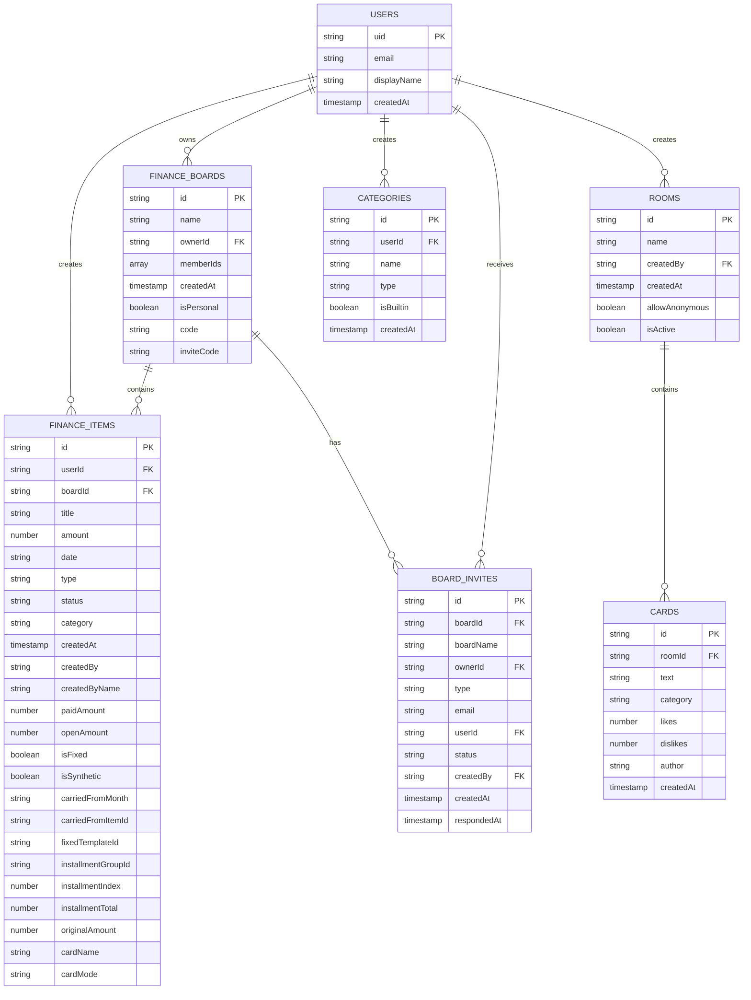
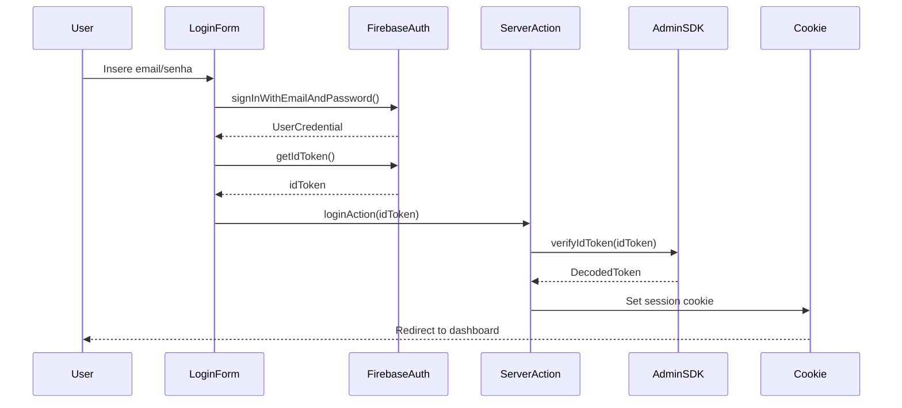

# Estrutura do Firebase

**Versão:** 0.8.2  
**Última Atualização:** 2025-01-30  
**Status:** Ativo

## Visão Geral

Este documento descreve a estrutura completa do Firebase utilizada no Retro-board, incluindo:
- Estrutura de coleções do Firestore
- Tipos TypeScript correspondentes
- Padrões de autenticação com Firebase Auth
- Regras de segurança (Security Rules)
- Padrões para queries e operações

O projeto utiliza Firebase para:
- **Firestore:** Banco de dados NoSQL para módulos Retrospectiva, Planning Poker e Finance
- **Firebase Auth:** Autenticação de usuários (email/senha)
- **Firebase Admin SDK:** Operações server-side e validação de tokens

## Estrutura de Coleções do Firestore

### Diagrama de Relacionamento (ER)



### Descrição das Coleções

#### 1. users (Firebase Auth)

Gerenciada automaticamente pelo Firebase Authentication. Contém informações básicas dos usuários autenticados.

**Campos principais:**
- `uid`: ID único do usuário (gerado pelo Firebase)
- `email`: Email do usuário
- `displayName`: Nome de exibição (opcional)
- `emailVerified`: Se o email foi verificado

#### 2. financeBoards

Boards financeiros que podem ser pessoais ou compartilhados entre múltiplos usuários.

**Campos:**
- `id`: ID único do board
- `name`: Nome do board
- `ownerId`: ID do usuário dono do board
- `memberIds`: Array de IDs de usuários membros
- `createdAt`: Data de criação
- `isPersonal`: Se é um board pessoal (true) ou compartilhado (false)
- `code`: Código único para compartilhamento
- `inviteCode`: Código de convite temporário

#### 3. financeItems

Lançamentos financeiros (receitas e despesas) associados a boards e usuários.

**Campos principais:**
- `id`: ID único do item
- `userId`: ID do usuário que criou
- `boardId`: ID do board ao qual pertence
- `title`: Descrição do lançamento
- `amount`: Valor monetário
- `date`: Data no formato "YYYY-MM-DD"
- `type`: Tipo ("income" ou "expense")
- `status`: Status ("paid", "pending", "partial", "moved")
- `category`: Categoria do lançamento
- `createdAt`: Timestamp de criação

**Campos opcionais:**
- `isFixed`: Se é uma despesa/receita fixa
- `isSynthetic`: Se é um lançamento sintético (calculado)
- `createdBy`: ID do usuário que lançou (em boards compartilhados)
- `createdByName`: Nome do usuário que lançou
- `paidAmount`: Valor já pago (para pagamentos parciais)
- `openAmount`: Valor em aberto
- `carriedFromMonth`: Mês de origem (formato "YYYY-MM")
- `carriedFromItemId`: ID do item original carregado
- `fixedTemplateId`: ID do template de despesa fixa
- `installmentGroupId`: ID do grupo de parcelamento
- `installmentIndex`: Índice da parcela (ex: 1 de 12)
- `installmentTotal`: Total de parcelas
- `originalAmount`: Valor original antes de parcelamento
- `cardName`: Nome do cartão (ex: "Nubank", "Santander")
- `cardMode`: Modo do cartão ("credit" ou "debit")

#### 4. boardInvites

Convites e solicitações de acesso a boards compartilhados.

**Campos:**
- `id`: ID único do convite
- `boardId`: ID do board
- `boardName`: Nome do board (para exibição)
- `ownerId`: ID do dono do board
- `type`: Tipo de convite ("email" ou "code")
- `email`: Email do convidado (quando type="email")
- `userId`: ID do usuário solicitante (quando type="code")
- `status`: Status ("pending", "accepted", "rejected", "cancelled")
- `createdBy`: ID de quem criou o convite
- `createdAt`: Timestamp de criação
- `respondedAt`: Timestamp da resposta (opcional)

#### 5. rooms

Salas de retrospectiva colaborativa.

**Campos:**
- `id`: ID único da sala
- `name`: Nome da sala
- `createdBy`: ID do usuário criador
- `createdAt`: Timestamp de criação
- `allowAnonymous`: Se permite participação anônima
- `isActive`: Se a sala está ativa

#### 6. cards

Cards de retrospectiva dentro de salas.

**Campos:**
- `id`: ID único do card
- `roomId`: ID da sala à qual pertence
- `text`: Texto do card
- `category`: Categoria ("bom", "ruim", "melhorar")
- `likes`: Número de likes
- `dislikes`: Número de dislikes
- `author`: Nome do autor (pode ser "Anônimo")
- `createdAt`: Timestamp de criação

#### 7. categories

Categorias personalizadas de lançamentos financeiros.

**Campos:**
- `id`: ID único da categoria
- `userId`: ID do usuário dono
- `name`: Nome da categoria
- `type`: Tipo ("income" ou "expense")
- `isBuiltin`: Se é uma categoria padrão do sistema
- `createdAt`: Timestamp de criação

## Tipos TypeScript

### Finance Module

```typescript
// types/finance.ts

export type FinanceStatus = "paid" | "pending" | "partial" | "moved";

export type FinanceItem = {
  id: string;
  userId: string;
  boardId?: string;
  
  // Dados principais
  title: string;
  amount: number;
  date: string; // "YYYY-MM-DD"
  type: "income" | "expense";
  status: FinanceStatus;
  category: string;
  createdAt: string;
  
  // Fixas / sintéticas
  isFixed?: boolean;
  isSynthetic?: boolean;
  
  // Quem lançou
  createdBy?: string;
  createdByName?: string;
  
  // Pagamentos parciais
  paidAmount?: number;
  openAmount?: number;
  
  // Contas carregadas
  carriedFromMonth?: string;
  carriedFromItemId?: string;
  
  // Parcelamento
  fixedTemplateId?: string;
  installmentGroupId?: string;
  installmentIndex?: number;
  installmentTotal?: number;
  originalAmount?: number;
  
  // Cartão
  cardName?: string;
  cardMode?: "credit" | "debit";
};

export type FinanceBoard = {
  id: string;
  name: string;
  ownerId: string;
  memberIds: string[];
  createdAt: string;
  isPersonal?: boolean;
  code?: string;
  inviteCode?: string;
};

export type FinanceBoardInviteStatus =
  | "pending"
  | "accepted"
  | "rejected"
  | "cancelled";

export type FinanceBoardInviteType = "email" | "code";

export type FinanceBoardInvite = {
  id: string;
  boardId: string;
  boardName: string;
  ownerId: string;
  type: FinanceBoardInviteType;
  email?: string;
  userId?: string;
  status: FinanceBoardInviteStatus;
  createdBy: string;
  createdAt: string;
  respondedAt?: string;
};
```

### Retrospective Module

```typescript
// types/card.ts

export type Card = {
  id: string;
  text: string;
  category: "bom" | "ruim" | "melhorar";
  likes: number;
  dislikes: number;
  author?: string;
};

export const CATEGORY_COLORS: Record<Card["category"], string> = {
  bom: "bg-green-200",
  ruim: "bg-red-200",
  melhorar: "bg-yellow-200",
};

export const CATEGORIES = Object.keys(CATEGORY_COLORS) as Card["category"][];
```

## Padrões de Autenticação

### Configuração do Firebase

#### Client-Side (lib/firebase.ts)

```typescript
import { initializeApp, getApps, getApp } from "firebase/app";
import { getFirestore } from "firebase/firestore";
import { getAuth } from "firebase/auth";

const firebaseConfig = {
  apiKey: process.env.NEXT_PUBLIC_FIREBASE_API_KEY,
  authDomain: process.env.NEXT_PUBLIC_FIREBASE_AUTH_DOMAIN,
  projectId: process.env.NEXT_PUBLIC_FIREBASE_PROJECT_ID,
  storageBucket: process.env.NEXT_PUBLIC_FIREBASE_STORAGE_BUCKET,
  messagingSenderId: process.env.NEXT_PUBLIC_FIREBASE_MESSAGING_SENDER_ID,
  appId: process.env.NEXT_PUBLIC_FIREBASE_APP_ID,
  measurementId: process.env.NEXT_PUBLIC_FIREBASE_MEASUREMENT_ID
};

// Garante que não inicialize múltiplas vezes
const app = getApps().length > 0 ? getApp() : initializeApp(firebaseConfig);
export const db = getFirestore(app);
export const auth = getAuth(app);
```

#### Server-Side (lib/firebase-admin.ts)

```typescript
import "server-only";
import { getApps, initializeApp, cert } from "firebase-admin/app";
import { getAuth } from "firebase-admin/auth";
import { getFirestore } from "firebase-admin/firestore";

// Função para parsear service account de variáveis de ambiente
function parseServiceAccount() {
  const b64 = process.env.FIREBASE_SERVICE_ACCOUNT_KEY_BASE64;
  if (b64 && b64.trim()) {
    const json = Buffer.from(b64, "base64").toString("utf8");
    return JSON.parse(json);
  }

  const raw = process.env.FIREBASE_SERVICE_ACCOUNT_KEY;
  if (!raw) {
    throw new Error("FIREBASE_SERVICE_ACCOUNT_KEY missing in .env.local");
  }

  const cleaned = raw.startsWith("'") && raw.endsWith("'")
    ? raw.slice(1, -1)
    : raw.startsWith('"') && raw.endsWith('"')
      ? raw.slice(1, -1)
      : raw;

  const normalized = cleaned.replace(/\\n/g, "\n");
  return JSON.parse(normalized);
}

const serviceAccount = parseServiceAccount();

const app = getApps().length > 0
  ? getApps()[0]
  : initializeApp({ credential: cert(serviceAccount) });

export const adminAuth = getAuth(app);
export const adminDb = getFirestore(app);
```

### Fluxo de Autenticação



### Padrão de Login

```typescript
// components/login/LoginForm.tsx
"use client";

import { useState } from "react";
import { signInWithEmailAndPassword } from "firebase/auth";
import { auth } from "@/lib/firebase";
import { loginAction } from "@/app/[locale]/tools/finance/login/actions";

export default function LoginForm({ locale }: { locale: string }) {
  const [email, setEmail] = useState("");
  const [password, setPassword] = useState("");
  const [loading, setLoading] = useState(false);
  const [error, setError] = useState("");

  const handleSubmit = async (e: React.FormEvent) => {
    e.preventDefault();
    setLoading(true);
    setError("");

    try {
      // 1. Autenticar com Firebase
      const userCredential = await signInWithEmailAndPassword(
        auth, 
        email, 
        password
      );
      
      // 2. Obter token de ID
      const idToken = await userCredential.user.getIdToken(true);
      
      // 3. Enviar para server action para criar sessão
      await loginAction(idToken, locale);
      
    } catch (firebaseError: any) {
      // Tratar erros específicos do Firebase
      const code = firebaseError?.code;
      
      if (code === "auth/invalid-credential" ||
          code === "auth/user-not-found" ||
          code === "auth/wrong-password" ||
          code === "auth/invalid-email") {
        setError("Email ou senha inválidos");
      } else {
        setError("Erro ao autenticar. Tente novamente.");
      }
    } finally {
      setLoading(false);
    }
  };

  return (
    <form onSubmit={handleSubmit}>
      {/* Campos do formulário */}
    </form>
  );
}
```

### Padrão de Registro

```typescript
// components/register/RegisterForm.tsx
"use client";

import { useState } from "react";
import { createUserWithEmailAndPassword } from "firebase/auth";
import { auth } from "@/lib/firebase";
import { loginAction } from "@/app/[locale]/tools/finance/login/actions";

export default function RegisterForm({ locale }: { locale: string }) {
  const [email, setEmail] = useState("");
  const [password, setPassword] = useState("");
  const [loading, setLoading] = useState(false);
  const [error, setError] = useState("");

  const handleSubmit = async (e: React.FormEvent) => {
    e.preventDefault();
    setLoading(true);
    setError("");

    try {
      // 1. Criar usuário no Firebase
      const userCredential = await createUserWithEmailAndPassword(
        auth,
        email,
        password
      );
      
      // 2. Obter token de ID
      const idToken = await userCredential.user.getIdToken(true);
      
      // 3. Criar sessão
      await loginAction(idToken, locale);
      
    } catch (firebaseError: any) {
      // Tratar erros específicos
      if (firebaseError.code === "auth/email-already-in-use") {
        setError("Este email já está em uso");
      } else if (firebaseError.code === "auth/invalid-email") {
        setError("Email inválido");
      } else if (firebaseError.code === "auth/weak-password") {
        setError("A senha deve ter pelo menos 6 caracteres");
      } else {
        setError("Erro ao criar conta. Tente novamente.");
      }
    } finally {
      setLoading(false);
    }
  };

  return (
    <form onSubmit={handleSubmit}>
      {/* Campos do formulário */}
    </form>
  );
}
```

### Padrão de Verificação de Autenticação

```typescript
// Verificar estado de autenticação em Client Component
"use client";

import { useEffect, useState } from "react";
import { onAuthStateChanged } from "firebase/auth";
import { auth } from "@/lib/firebase";

export default function ProtectedComponent() {
  const [user, setUser] = useState(null);
  const [loading, setLoading] = useState(true);

  useEffect(() => {
    const unsubscribe = onAuthStateChanged(auth, (currentUser) => {
      setUser(currentUser);
      setLoading(false);
    });

    return () => unsubscribe();
  }, []);

  if (loading) {
    return <div>Carregando...</div>;
  }

  if (!user) {
    return <div>Você precisa estar autenticado</div>;
  }

  return <div>Conteúdo protegido</div>;
}
```

### Tratamento de Erros de Autenticação

```typescript
// Função auxiliar para tratar erros do Firebase Auth
function handleAuthError(error: any): string {
  const errorCode = error.code;
  
  switch (errorCode) {
    case 'auth/invalid-email':
      return 'Email inválido';
    case 'auth/user-disabled':
      return 'Usuário desabilitado';
    case 'auth/user-not-found':
    case 'auth/wrong-password':
    case 'auth/invalid-credential':
      return 'Email ou senha inválidos';
    case 'auth/email-already-in-use':
      return 'Este email já está em uso';
    case 'auth/weak-password':
      return 'A senha deve ter pelo menos 6 caracteres';
    case 'auth/operation-not-allowed':
      return 'Operação não permitida';
    case 'auth/too-many-requests':
      return 'Muitas tentativas. Tente novamente mais tarde';
    default:
      return 'Erro ao autenticar. Tente novamente.';
  }
}
```

## Regras de Segurança (Security Rules)

### Estrutura Recomendada

```javascript
rules_version = '2';
service cloud.firestore {
  match /databases/{database}/documents {
    
    // Função auxiliar para verificar autenticação
    function isAuthenticated() {
      return request.auth != null;
    }
    
    // Função auxiliar para verificar se é o próprio usuário
    function isOwner(userId) {
      return isAuthenticated() && request.auth.uid == userId;
    }
    
    // Função auxiliar para verificar se é membro do board
    function isBoardMember(boardData) {
      return isAuthenticated() && (
        boardData.ownerId == request.auth.uid ||
        request.auth.uid in boardData.memberIds
      );
    }

    
    // ===== FINANCE BOARDS =====
    match /financeBoards/{boardId} {
      // Leitura: apenas membros do board
      allow read: if isAuthenticated() && (
        resource.data.ownerId == request.auth.uid ||
        request.auth.uid in resource.data.memberIds
      );
      
      // Criação: qualquer usuário autenticado
      allow create: if isAuthenticated() && 
        request.resource.data.ownerId == request.auth.uid;
      
      // Atualização: apenas o dono
      allow update: if isAuthenticated() && 
        resource.data.ownerId == request.auth.uid;
      
      // Exclusão: apenas o dono
      allow delete: if isAuthenticated() && 
        resource.data.ownerId == request.auth.uid;
    }
    
    // ===== FINANCE ITEMS =====
    match /financeItems/{itemId} {
      // Leitura: usuário dono ou membro do board
      allow read: if isAuthenticated() && (
        resource.data.userId == request.auth.uid ||
        (resource.data.boardId != null && 
         isBoardMember(get(/databases/$(database)/documents/financeBoards/$(resource.data.boardId)).data))
      );
      
      // Criação: usuário autenticado, deve ser dono ou membro do board
      allow create: if isAuthenticated() && (
        request.resource.data.userId == request.auth.uid &&
        (request.resource.data.boardId == null ||
         isBoardMember(get(/databases/$(database)/documents/financeBoards/$(request.resource.data.boardId)).data))
      );
      
      // Atualização: usuário dono ou membro do board
      allow update: if isAuthenticated() && (
        resource.data.userId == request.auth.uid ||
        (resource.data.boardId != null && 
         isBoardMember(get(/databases/$(database)/documents/financeBoards/$(resource.data.boardId)).data))
      );
      
      // Exclusão: apenas o usuário dono
      allow delete: if isAuthenticated() && 
        resource.data.userId == request.auth.uid;
    }
    
    // ===== BOARD INVITES =====
    match /boardInvites/{inviteId} {
      // Leitura: dono do board ou destinatário do convite
      allow read: if isAuthenticated() && (
        resource.data.ownerId == request.auth.uid ||
        resource.data.userId == request.auth.uid ||
        resource.data.email == request.auth.token.email
      );
      
      // Criação: dono do board (convite por email) ou usuário autenticado (pedido por código)
      allow create: if isAuthenticated() && (
        (request.resource.data.type == "email" && 
         request.resource.data.ownerId == request.auth.uid) ||
        (request.resource.data.type == "code" && 
         request.resource.data.userId == request.auth.uid)
      );
      
      // Atualização: dono do board ou destinatário (para aceitar/rejeitar)
      allow update: if isAuthenticated() && (
        resource.data.ownerId == request.auth.uid ||
        resource.data.userId == request.auth.uid ||
        resource.data.email == request.auth.token.email
      );
      
      // Exclusão: dono do board ou criador do convite
      allow delete: if isAuthenticated() && (
        resource.data.ownerId == request.auth.uid ||
        resource.data.createdBy == request.auth.uid
      );
    }

    
    // ===== ROOMS (Retrospective) =====
    match /rooms/{roomId} {
      // Leitura: qualquer usuário autenticado
      allow read: if isAuthenticated();
      
      // Criação: qualquer usuário autenticado
      allow create: if isAuthenticated() && 
        request.resource.data.createdBy == request.auth.uid;
      
      // Atualização: apenas o criador
      allow update: if isAuthenticated() && 
        resource.data.createdBy == request.auth.uid;
      
      // Exclusão: apenas o criador
      allow delete: if isAuthenticated() && 
        resource.data.createdBy == request.auth.uid;
    }
    
    // ===== CARDS (Retrospective) =====
    match /cards/{cardId} {
      // Leitura: qualquer usuário autenticado
      allow read: if isAuthenticated();
      
      // Criação: qualquer usuário autenticado
      allow create: if isAuthenticated();
      
      // Atualização: qualquer usuário autenticado (para votos)
      allow update: if isAuthenticated();
      
      // Exclusão: apenas o autor ou criador da sala
      allow delete: if isAuthenticated() && (
        resource.data.author == request.auth.token.email ||
        get(/databases/$(database)/documents/rooms/$(resource.data.roomId)).data.createdBy == request.auth.uid
      );
    }
    
    // ===== CATEGORIES =====
    match /categories/{categoryId} {
      // Leitura: apenas o dono
      allow read: if isAuthenticated() && 
        resource.data.userId == request.auth.uid;
      
      // Criação: qualquer usuário autenticado
      allow create: if isAuthenticated() && 
        request.resource.data.userId == request.auth.uid;
      
      // Atualização: apenas o dono
      allow update: if isAuthenticated() && 
        resource.data.userId == request.auth.uid;
      
      // Exclusão: apenas o dono (se não for builtin)
      allow delete: if isAuthenticated() && 
        resource.data.userId == request.auth.uid &&
        resource.data.isBuiltin == false;
    }
  }
}
```

### Princípios de Segurança

1. **Autenticação Obrigatória:** Todas as operações requerem usuário autenticado
2. **Ownership:** Usuários só podem modificar seus próprios dados
3. **Board Membership:** Acesso a dados compartilhados apenas para membros
4. **Validação de Dados:** Regras validam estrutura e propriedade dos dados
5. **Least Privilege:** Permissões mínimas necessárias para cada operação

## Padrões de Queries e Operações

### Criar Documento

```typescript
import { collection, addDoc, serverTimestamp } from 'firebase/firestore';
import { db } from '@/lib/firebase';

async function createFinanceItem(data: Partial<FinanceItem>) {
  const docRef = await addDoc(collection(db, 'financeItems'), {
    ...data,
    createdAt: serverTimestamp(),
  });
  
  return docRef.id;
}
```

### Ler Documento

```typescript
import { doc, getDoc } from 'firebase/firestore';
import { db } from '@/lib/firebase';

async function getFinanceItem(itemId: string): Promise<FinanceItem | null> {
  const docRef = doc(db, 'financeItems', itemId);
  const docSnap = await getDoc(docRef);
  
  if (!docSnap.exists()) {
    return null;
  }
  
  return {
    id: docSnap.id,
    ...docSnap.data()
  } as FinanceItem;
}
```

### Query com Filtros

```typescript
import { collection, query, where, getDocs, orderBy } from 'firebase/firestore';
import { db } from '@/lib/firebase';

async function getItemsByBoard(
  boardId: string,
  month: string
): Promise<FinanceItem[]> {
  const q = query(
    collection(db, 'financeItems'),
    where('boardId', '==', boardId),
    where('date', '>=', `${month}-01`),
    where('date', '<=', `${month}-31`),
    orderBy('date', 'desc')
  );
  
  const snapshot = await getDocs(q);
  
  return snapshot.docs.map(doc => ({
    id: doc.id,
    ...doc.data()
  })) as FinanceItem[];
}
```

### Atualizar Documento

```typescript
import { doc, updateDoc } from 'firebase/firestore';
import { db } from '@/lib/firebase';

async function updateFinanceItem(
  itemId: string,
  updates: Partial<FinanceItem>
): Promise<void> {
  const docRef = doc(db, 'financeItems', itemId);
  await updateDoc(docRef, updates);
}
```

### Deletar Documento

```typescript
import { doc, deleteDoc } from 'firebase/firestore';
import { db } from '@/lib/firebase';

async function deleteFinanceItem(itemId: string): Promise<void> {
  const docRef = doc(db, 'financeItems', itemId);
  await deleteDoc(docRef);
}
```

### Listener em Tempo Real

```typescript
import { collection, query, where, onSnapshot } from 'firebase/firestore';
import { db } from '@/lib/firebase';
import { useEffect, useState } from 'react';

function useFinanceItems(boardId: string) {
  const [items, setItems] = useState<FinanceItem[]>([]);
  const [loading, setLoading] = useState(true);

  useEffect(() => {
    const q = query(
      collection(db, 'financeItems'),
      where('boardId', '==', boardId)
    );

    const unsubscribe = onSnapshot(q, (snapshot) => {
      const itemsData = snapshot.docs.map(doc => ({
        id: doc.id,
        ...doc.data()
      })) as FinanceItem[];
      
      setItems(itemsData);
      setLoading(false);
    });

    return () => unsubscribe();
  }, [boardId]);

  return { items, loading };
}
```

### Transações

```typescript
import { runTransaction, doc } from 'firebase/firestore';
import { db } from '@/lib/firebase';

async function transferItemToBoard(
  itemId: string,
  newBoardId: string
): Promise<void> {
  const itemRef = doc(db, 'financeItems', itemId);
  
  await runTransaction(db, async (transaction) => {
    const itemDoc = await transaction.get(itemRef);
    
    if (!itemDoc.exists()) {
      throw new Error('Item não encontrado');
    }
    
    transaction.update(itemRef, {
      boardId: newBoardId,
      status: 'moved'
    });
  });
}
```

### Batch Operations

```typescript
import { writeBatch, doc } from 'firebase/firestore';
import { db } from '@/lib/firebase';

async function deleteMultipleItems(itemIds: string[]): Promise<void> {
  const batch = writeBatch(db);
  
  itemIds.forEach(itemId => {
    const itemRef = doc(db, 'financeItems', itemId);
    batch.delete(itemRef);
  });
  
  await batch.commit();
}
```

## Boas Práticas

### 1. Sempre Use serverTimestamp()

```typescript
// ✅ CORRETO
import { serverTimestamp } from 'firebase/firestore';

await addDoc(collection(db, 'items'), {
  title: 'Novo item',
  createdAt: serverTimestamp() // Usa o timestamp do servidor
});

// ❌ INCORRETO
await addDoc(collection(db, 'items'), {
  title: 'Novo item',
  createdAt: new Date().toISOString() // Usa timestamp do cliente
});
```

### 2. Trate Erros Adequadamente

```typescript
async function safeFirestoreOperation<T>(
  operation: () => Promise<T>,
  errorMessage: string
): Promise<T | null> {
  try {
    return await operation();
  } catch (error: any) {
    console.error(errorMessage, error);
    
    if (error.code === 'permission-denied') {
      throw new Error('Sem permissão para esta operação');
    } else if (error.code === 'not-found') {
      throw new Error('Recurso não encontrado');
    } else if (error.code === 'unavailable') {
      throw new Error('Serviço temporariamente indisponível');
    }
    
    throw new Error('Erro ao processar operação');
  }
}
```

### 3. Use Índices Compostos

Para queries com múltiplos filtros, crie índices compostos no Firebase Console:

```typescript
// Esta query requer índice composto em (boardId, date)
const q = query(
  collection(db, 'financeItems'),
  where('boardId', '==', boardId),
  where('date', '>=', startDate),
  orderBy('date', 'desc')
);
```

### 4. Limite Resultados de Queries

```typescript
import { query, limit } from 'firebase/firestore';

// Limitar a 50 resultados
const q = query(
  collection(db, 'financeItems'),
  where('boardId', '==', boardId),
  orderBy('date', 'desc'),
  limit(50)
);
```

### 5. Paginação

```typescript
import { query, orderBy, startAfter, limit, getDocs } from 'firebase/firestore';

async function getNextPage(
  lastVisible: any,
  pageSize: number = 20
): Promise<FinanceItem[]> {
  const q = query(
    collection(db, 'financeItems'),
    orderBy('date', 'desc'),
    startAfter(lastVisible),
    limit(pageSize)
  );
  
  const snapshot = await getDocs(q);
  
  return snapshot.docs.map(doc => ({
    id: doc.id,
    ...doc.data()
  })) as FinanceItem[];
}
```

### 6. Validação de Dados

```typescript
// Validar dados antes de enviar ao Firestore
function validateFinanceItem(data: Partial<FinanceItem>): boolean {
  if (!data.title?.trim()) {
    throw new Error('Título é obrigatório');
  }
  
  if (!data.amount || data.amount <= 0) {
    throw new Error('Valor deve ser maior que zero');
  }
  
  if (!data.date || !/^\d{4}-\d{2}-\d{2}$/.test(data.date)) {
    throw new Error('Data inválida (formato: YYYY-MM-DD)');
  }
  
  if (!['income', 'expense'].includes(data.type || '')) {
    throw new Error('Tipo deve ser "income" ou "expense"');
  }
  
  return true;
}
```

### 7. Otimização de Leituras

```typescript
// ✅ CORRETO: Buscar apenas campos necessários
import { query, select } from 'firebase/firestore';

const q = query(
  collection(db, 'financeItems'),
  where('boardId', '==', boardId)
);

// ❌ EVITAR: Buscar documentos completos quando só precisa de alguns campos
// Firestore não suporta select() diretamente, mas você pode:
// 1. Usar Cloud Functions para agregações
// 2. Estruturar dados para minimizar leituras
// 3. Cachear dados no cliente quando apropriado
```

### 8. Segurança no Cliente

```typescript
// ✅ CORRETO: Validar permissões no cliente E no servidor (Security Rules)
async function deleteItem(itemId: string, userId: string) {
  // Validação no cliente (UX)
  const item = await getFinanceItem(itemId);
  if (item?.userId !== userId) {
    throw new Error('Você não tem permissão para deletar este item');
  }
  
  // Security Rules no servidor validarão novamente
  await deleteDoc(doc(db, 'financeItems', itemId));
}

// ❌ INCORRETO: Confiar apenas em validação no cliente
async function deleteItem(itemId: string) {
  // Sem validação - depende apenas das Security Rules
  await deleteDoc(doc(db, 'financeItems', itemId));
}
```

## Variáveis de Ambiente

### Client-Side (.env.local)

```bash
# Firebase Client SDK
NEXT_PUBLIC_FIREBASE_API_KEY=your_api_key
NEXT_PUBLIC_FIREBASE_AUTH_DOMAIN=your_project.firebaseapp.com
NEXT_PUBLIC_FIREBASE_PROJECT_ID=your_project_id
NEXT_PUBLIC_FIREBASE_STORAGE_BUCKET=your_project.appspot.com
NEXT_PUBLIC_FIREBASE_MESSAGING_SENDER_ID=your_sender_id
NEXT_PUBLIC_FIREBASE_APP_ID=your_app_id
NEXT_PUBLIC_FIREBASE_MEASUREMENT_ID=your_measurement_id
```

### Server-Side (.env.local)

```bash
# Firebase Admin SDK (escolha uma das opções)

# Opção 1: JSON completo (com \n escapado)
FIREBASE_SERVICE_ACCOUNT_KEY='{"type":"service_account","project_id":"..."}'

# Opção 2: Base64 encoded (recomendado para CI/CD)
FIREBASE_SERVICE_ACCOUNT_KEY_BASE64=eyJ0eXBlIjoic2VydmljZV9hY2NvdW50...
```

## Troubleshooting

### Erro: "Missing or insufficient permissions"

**Causa:** Security Rules bloqueando a operação.

**Solução:**
1. Verificar se o usuário está autenticado
2. Verificar se as Security Rules permitem a operação
3. Verificar se os campos obrigatórios estão presentes
4. Testar as regras no Firebase Console (Rules Playground)

### Erro: "The query requires an index"

**Causa:** Query com múltiplos filtros sem índice composto.

**Solução:**
1. Clicar no link fornecido no erro (abre Firebase Console)
2. Criar o índice composto automaticamente
3. Aguardar alguns minutos para o índice ser criado

### Erro: "Firebase: Error (auth/invalid-api-key)"

**Causa:** Variável de ambiente `NEXT_PUBLIC_FIREBASE_API_KEY` incorreta ou ausente.

**Solução:**
1. Verificar arquivo `.env.local`
2. Reiniciar o servidor de desenvolvimento após alterar `.env.local`
3. Verificar se o arquivo está na raiz do projeto

### Erro: "Firebase Admin SDK initialization failed"

**Causa:** Service Account Key incorreta ou mal formatada.

**Solução:**
1. Verificar formato do JSON no `.env.local`
2. Garantir que `\n` esteja escapado corretamente
3. Considerar usar a opção Base64 encoded
4. Verificar permissões do Service Account no Firebase Console

---

**Referências:**
- [Firebase Documentation](https://firebase.google.com/docs)
- [Firestore Security Rules](https://firebase.google.com/docs/firestore/security/get-started)
- [Firebase Auth Documentation](https://firebase.google.com/docs/auth)
- [Next.js with Firebase](https://firebase.google.com/docs/web/setup)
