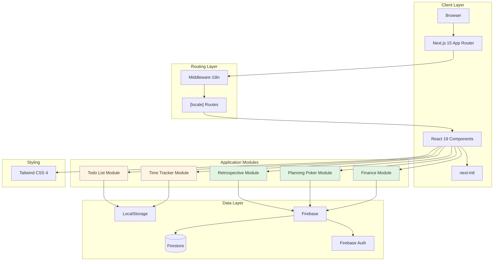
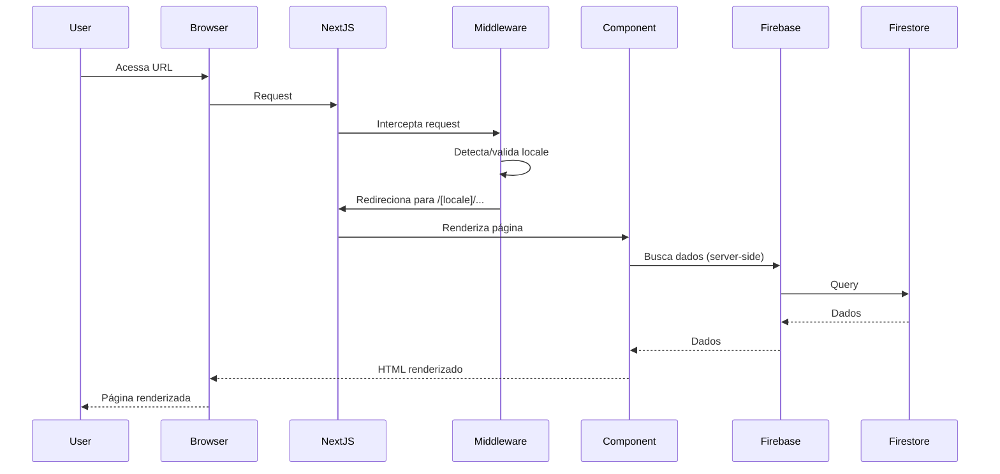
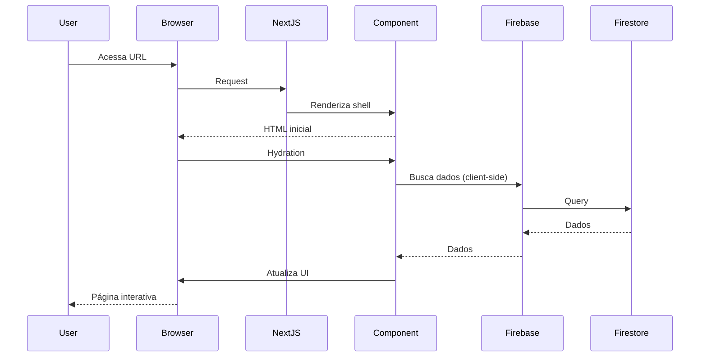

# Arquitetura Geral do Sistema

**Versão:** 0.8.2  
**Última Atualização:** 2025-01-30  
**Status:** Ativo

## Visão Geral

O Retro-board é uma aplicação web colaborativa construída com tecnologias modernas que oferece múltiplos módulos para gestão de projetos, finanças pessoais e colaboração em equipe. A arquitetura segue o padrão de aplicação web moderna com renderização híbrida (Server-Side Rendering e Client-Side Rendering), integração com serviços de backend em nuvem e suporte completo a internacionalização.

Este documento descreve a arquitetura geral do sistema, suas camadas principais, tecnologias utilizadas e como os componentes se relacionam.

## Diagrama de Arquitetura



**Legenda:**
- 🟢 Verde: Módulos que utilizam Firebase (persistência em nuvem)
- 🟡 Amarelo: Módulos que utilizam LocalStorage (persistência local)

## Camadas da Arquitetura

### 1. Client Layer (Camada de Cliente)

A camada de cliente é responsável pela interface do usuário e pela experiência de navegação. É composta por:

#### Browser
- Ambiente de execução da aplicação
- Suporta navegadores modernos (Chrome, Firefox, Safari, Edge)
- Requer JavaScript habilitado para funcionalidades completas

#### Next.js 15 App Router
- Framework React com renderização híbrida (SSR + CSR)
- App Router: nova arquitetura de roteamento baseada em sistema de arquivos
- Suporte nativo a Server Components e Client Components
- Otimizações automáticas de performance (code splitting, lazy loading)
- Integração com Turbopack para builds rápidos

**Características principais:**
- **Server Components (padrão):** Renderizados no servidor, reduzem bundle JavaScript
- **Client Components:** Marcados com `'use client'`, permitem interatividade e hooks
- **Streaming SSR:** Renderização progressiva para melhor performance
- **Automatic Static Optimization:** Páginas estáticas quando possível

#### React 19
- Biblioteca de UI para construção de componentes
- Versão mais recente com melhorias de performance
- Suporte a Concurrent Features e Suspense
- Hooks modernos para gerenciamento de estado

#### next-intl
- Biblioteca de internacionalização para Next.js
- Suporte a múltiplos idiomas: português (pt), inglês (en), espanhol (es)
- Integração com App Router através de middleware
- Traduções tipadas com TypeScript

### 2. Routing Layer (Camada de Roteamento)

A camada de roteamento gerencia a navegação e a internacionalização da aplicação.

#### Middleware i18n
- Intercepta todas as requisições antes de chegarem às páginas
- Detecta o idioma preferido do usuário (cookie, header Accept-Language, URL)
- Redireciona para a rota correta com prefixo de locale (`/pt`, `/en`, `/es`)
- Valida e normaliza o locale em cada requisição

**Fluxo de detecção de idioma:**
1. Verifica cookie `NEXT_LOCALE`
2. Verifica parâmetro `[locale]` na URL
3. Verifica header `Accept-Language` do navegador
4. Fallback para idioma padrão (português)

#### [locale] Routes
- Estrutura de rotas dinâmicas com prefixo de idioma
- Todas as páginas são organizadas sob `app/[locale]/`
- Permite URLs como `/pt/finance`, `/en/retrospective`, `/es/todo`
- Compartilhamento de layouts entre idiomas

**Exemplo de estrutura:**
```
app/
├── [locale]/
│   ├── layout.tsx          # Layout compartilhado
│   ├── page.tsx            # Página inicial
│   ├── finance/
│   │   └── page.tsx        # Módulo Finance
│   ├── retrospective/
│   │   └── [roomId]/
│   │       └── page.tsx    # Sala de retrospectiva
│   └── todo/
│       └── page.tsx        # Módulo Todo
```

### 3. Application Modules (Camada de Aplicação)

A camada de aplicação contém os módulos funcionais da aplicação. Cada módulo é independente e focado em um domínio específico.

#### Retrospective Module
- **Propósito:** Facilitar reuniões de retrospectiva ágil
- **Funcionalidades:**
  - Criação de salas colaborativas
  - Adição de cards em categorias (bom, ruim, melhorar)
  - Sistema de votação em tempo real (likes/dislikes)
  - Suporte a usuários anônimos
- **Persistência:** Firebase Firestore
- **Tempo real:** Atualizações automáticas via listeners do Firestore

#### Planning Poker Module
- **Propósito:** Estimativa colaborativa de tarefas
- **Funcionalidades:**
  - Criação de sessões de estimativa
  - Votação com cartas de Fibonacci
  - Revelação simultânea de votos
- **Persistência:** Firebase Firestore
- **Tempo real:** Sincronização de votos entre participantes

#### Todo List Module
- **Propósito:** Gerenciamento de tarefas pessoais
- **Funcionalidades:**
  - Criação, edição e exclusão de tarefas
  - Marcação de conclusão
  - Datas de vencimento opcionais
  - Filtros e ordenação
- **Persistência:** LocalStorage (dados locais ao navegador)
- **Offline-first:** Funciona sem conexão com internet

#### Finance Module
- **Propósito:** Gestão financeira pessoal e compartilhada
- **Funcionalidades:**
  - Boards pessoais e compartilhados
  - Lançamentos de receitas e despesas
  - Categorização customizável
  - Métricas e relatórios
  - Sistema de convites e compartilhamento
  - Contas fixas e parceladas
  - Gestão de cartões de crédito
- **Persistência:** Firebase Firestore
- **Autenticação:** Obrigatória via Firebase Auth
- **Compartilhamento:** Múltiplos usuários por board

#### Time Tracker Module
- **Propósito:** Controle de ponto e cálculo de horas trabalhadas
- **Funcionalidades:**
  - Registro de entrada/saída
  - Cálculo automático de horas trabalhadas
  - Cálculo de intervalo de almoço
  - Banco de horas
  - Sugestão de horário de saída
- **Persistência:** LocalStorage
- **Offline-first:** Funciona sem conexão

### 4. Data Layer (Camada de Dados)

A camada de dados gerencia a persistência e recuperação de informações.

#### LocalStorage
- **Uso:** Módulos Todo e Time Tracker
- **Características:**
  - Persistência local no navegador
  - Limite de ~5-10MB por domínio
  - Dados não sincronizados entre dispositivos
  - Acesso síncrono e rápido
- **Formato:** JSON serializado
- **Vantagens:**
  - Funciona offline
  - Sem necessidade de autenticação
  - Latência zero
- **Desvantagens:**
  - Dados podem ser perdidos (limpeza de cache)
  - Não compartilhável entre usuários
  - Limitado a um dispositivo/navegador

#### Firebase
Plataforma de backend como serviço (BaaS) do Google que fornece:

##### Firestore (Database)
- **Tipo:** Banco de dados NoSQL orientado a documentos
- **Uso:** Módulos Retrospective, Planning Poker e Finance
- **Características:**
  - Estrutura de coleções e documentos
  - Queries flexíveis com índices automáticos
  - Atualizações em tempo real via listeners
  - Escalabilidade automática
  - Regras de segurança declarativas
- **Coleções principais:**
  - `users`: Dados de usuários
  - `rooms`: Salas de retrospectiva
  - `cards`: Cards de retrospectiva
  - `financeBoards`: Boards financeiros
  - `financeItems`: Lançamentos financeiros
  - `boardInvites`: Convites de compartilhamento
  - `categories`: Categorias customizadas

##### Firebase Auth (Authentication)
- **Uso:** Módulos que requerem autenticação (Finance, Retrospective, Planning Poker)
- **Métodos suportados:**
  - Email/senha
  - Provedores OAuth (Google, GitHub, etc.) - configurável
- **Características:**
  - Gerenciamento de sessões
  - Tokens JWT para autorização
  - Integração com Firestore Security Rules
  - Recuperação de senha
  - Verificação de email

**Fluxo de autenticação:**
1. Usuário faz login via Firebase Auth
2. Firebase retorna token JWT
3. Token é incluído automaticamente em requisições ao Firestore
4. Security Rules validam permissões baseadas no token

### 5. Styling (Camada de Estilização)

#### Tailwind CSS 4
- **Tipo:** Framework CSS utility-first
- **Características:**
  - Classes utilitárias para estilização rápida
  - Design system consistente
  - Responsividade mobile-first
  - Dark mode suportado (configurável)
  - Customização via `tailwind.config.js`
- **Vantagens:**
  - Desenvolvimento rápido
  - Bundle CSS otimizado (apenas classes usadas)
  - Consistência visual
  - Manutenibilidade

**Exemplo de uso:**
```tsx
<button className="bg-blue-500 hover:bg-blue-600 text-white font-bold py-2 px-4 rounded">
  Salvar
</button>
```

## Tecnologias Principais

### Frontend

| Tecnologia | Versão | Propósito |
|------------|--------|-----------|
| Next.js | 15.x | Framework React com SSR/SSG |
| React | 19.x | Biblioteca de UI |
| TypeScript | 5.x | Tipagem estática |
| Tailwind CSS | 4.x | Framework CSS |
| next-intl | 3.x | Internacionalização |

### Backend/Serviços

| Tecnologia | Propósito |
|------------|-----------|
| Firebase Firestore | Banco de dados NoSQL |
| Firebase Auth | Autenticação de usuários |
| Vercel | Hospedagem e deploy |

### Desenvolvimento

| Tecnologia | Propósito |
|------------|-----------|
| Turbopack | Build tool rápido |
| ESLint | Linting de código |
| Prettier | Formatação de código |
| Vitest | Framework de testes |
| fast-check | Property-based testing |

## Fluxo de Dados

### Requisição Típica (Server Component)



### Requisição Típica (Client Component)



## Padrões Arquiteturais

### Server Components vs Client Components

#### Server Components (Padrão)
- **Quando usar:**
  - Páginas estáticas ou com dados que podem ser buscados no servidor
  - Componentes sem interatividade
  - Componentes que fazem queries pesadas
- **Vantagens:**
  - Menor bundle JavaScript
  - Melhor SEO
  - Acesso direto a recursos do servidor
- **Limitações:**
  - Não podem usar hooks (`useState`, `useEffect`, etc.)
  - Não podem usar event handlers (`onClick`, etc.)

**Exemplo:**
```tsx
// app/[locale]/finance/page.tsx
import { getTranslations } from 'next-intl/server';

export default async function FinancePage() {
  const t = await getTranslations('Finance');
  
  return (
    <div>
      <h1>{t('title')}</h1>
      {/* Conteúdo estático */}
    </div>
  );
}
```

#### Client Components
- **Quando usar:**
  - Componentes com interatividade (formulários, botões, etc.)
  - Componentes que usam hooks
  - Componentes que precisam de estado local
- **Marcação:** Diretiva `'use client'` no topo do arquivo
- **Vantagens:**
  - Interatividade completa
  - Acesso a APIs do navegador
  - Hooks e estado local

**Exemplo:**
```tsx
// components/finance/FinanceForm.tsx
'use client';

import { useState } from 'react';
import { useTranslations } from 'next-intl';

export default function FinanceForm() {
  const t = useTranslations('Finance');
  const [amount, setAmount] = useState('');
  
  return (
    <form>
      <input 
        value={amount}
        onChange={(e) => setAmount(e.target.value)}
      />
      <button type="submit">{t('save')}</button>
    </form>
  );
}
```

### Composição de Componentes

A aplicação segue o padrão de composição onde:
- **Layouts** são Server Components que envolvem páginas
- **Páginas** podem ser Server ou Client Components
- **Componentes de UI** são majoritariamente Client Components
- **Componentes de dados** podem ser Server Components

**Hierarquia típica:**
```
Layout (Server)
└── Page (Server)
    ├── Navbar (Client)
    │   ├── UserMenu (Client)
    │   └── SelectLanguage (Client)
    └── ModuleContent (Client)
        ├── Form (Client)
        └── List (Client)
```

## Segurança

### Firestore Security Rules

As regras de segurança do Firestore garantem que:
- Usuários só acessam seus próprios dados
- Boards compartilhados são acessíveis apenas por membros
- Operações de escrita requerem autenticação
- Validação de dados no servidor

**Exemplo de regra:**
```javascript
match /financeItems/{itemId} {
  allow read: if request.auth != null && 
    (resource.data.userId == request.auth.uid || 
     resource.data.boardId in get(/databases/$(database)/documents/users/$(request.auth.uid)).data.boardIds);
  
  allow write: if request.auth != null && 
    request.resource.data.userId == request.auth.uid;
}
```

### Autenticação

- Todas as rotas protegidas verificam autenticação
- Tokens JWT são validados automaticamente pelo Firebase
- Sessões são gerenciadas via cookies seguros
- Logout limpa tokens e sessões

## Performance

### Otimizações Implementadas

1. **Code Splitting:** Módulos carregados sob demanda
2. **Lazy Loading:** Componentes pesados carregados quando necessário
3. **Image Optimization:** Next.js Image component com otimização automática
4. **Static Generation:** Páginas estáticas quando possível
5. **Caching:** Cache de dados do Firestore
6. **Bundle Optimization:** Tree shaking e minificação

### Métricas Alvo

- **First Contentful Paint (FCP):** < 1.5s
- **Largest Contentful Paint (LCP):** < 2.5s
- **Time to Interactive (TTI):** < 3.5s
- **Cumulative Layout Shift (CLS):** < 0.1

## Escalabilidade

### Horizontal

- **Frontend:** Vercel Edge Network distribui globalmente
- **Backend:** Firebase escala automaticamente
- **Database:** Firestore escala horizontalmente

### Vertical

- **Otimização de queries:** Índices compostos no Firestore
- **Paginação:** Implementada em listas grandes
- **Lazy loading:** Dados carregados sob demanda

## Monitoramento

### Ferramentas Recomendadas

- **Vercel Analytics:** Métricas de performance e uso
- **Firebase Console:** Monitoramento de Firestore e Auth
- **Sentry:** Rastreamento de erros (opcional)
- **Google Analytics:** Análise de comportamento (opcional)

## Próximos Passos

Para entender melhor a arquitetura, consulte:

- [Fluxo de Dados](./data-flow.md) - Detalhes sobre comunicação cliente-servidor
- [Estrutura do Firebase](./firebase-structure.md) - Modelo de dados completo
- [Padrões de Componentes](../standards/component-patterns.md) - Guia de componentes React
- [Estrutura do Projeto](../standards/project-structure.md) - Organização de arquivos

---

**Referências:**
- [Next.js 15 Documentation](https://nextjs.org/docs)
- [React 19 Documentation](https://react.dev)
- [Firebase Documentation](https://firebase.google.com/docs)
- [Tailwind CSS Documentation](https://tailwindcss.com/docs)
