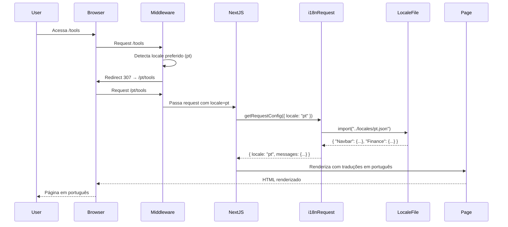

# Configuração de Internacionalização (i18n)

**Versão:** 0.8.2  
**Última Atualização:** 2025-01-29

## Visão Geral

O projeto Retro-board utiliza [next-intl](https://next-intl-docs.vercel.app/) para internacionalização, suportando três idiomas:
- **Português (pt)** - Idioma padrão
- **Inglês (en)**
- **Espanhol (es)**

Este documento explica como o sistema de i18n está configurado e como ele funciona.

## Estrutura de Arquivos

### Arquivos de Locale

Os arquivos de tradução estão localizados no diretório `/locales`:

```
locales/
├── pt.json    # Português (padrão)
├── en.json    # Inglês
└── es.json    # Espanhol
```

Cada arquivo contém um objeto JSON com traduções organizadas hierarquicamente por namespace:

```json
{
  "Navbar": {
    "home": "Início",
    "tools": "Ferramentas",
    "language": "Idioma"
  },
  "Finance": {
    "title": "Minhas Finanças",
    "save": "Salvar",
    "cancel": "Cancelar"
  }
}
```

### Arquivos de Configuração

#### 1. `i18n/routing.ts`

Define os locales suportados e o locale padrão:

```typescript
import { defineRouting } from "next-intl/routing";

export const routing = defineRouting({
  // Lista de todos os locales suportados
  locales: ["pt", "en", "es"],

  // Locale usado quando nenhum locale corresponde
  defaultLocale: "pt",
});

export type Locale = (typeof routing.locales)[number];
```

**Importante:** Se você adicionar um novo idioma, deve:
1. Adicionar o código do idioma no array `locales`
2. Criar o arquivo correspondente em `/locales` (ex: `fr.json`)

#### 2. `i18n/request.ts`

Configura como as mensagens são carregadas para cada requisição:

```typescript
import { getRequestConfig } from "next-intl/server";
import { Locale, routing } from "./routing";

export default getRequestConfig(async ({ requestLocale }) => {
  // Corresponde ao segmento [locale] da URL
  let locale = await requestLocale;

  // Garante que um locale válido seja usado
  if (!locale || !routing.locales.includes(locale as Locale)) {
    locale = routing.defaultLocale;
  }

  return {
    locale,
    // Carrega as mensagens do arquivo JSON correspondente
    messages: (await import(`../locales/${locale}.json`)).default,
  };
});
```

**Como funciona:**
1. Extrai o locale da URL (ex: `/pt/tools`, `/en/tools`)
2. Valida se o locale é suportado
3. Se não for válido, usa o locale padrão (`pt`)
4. Carrega o arquivo JSON correspondente

#### 3. `middleware.ts`

Intercepta todas as requisições para aplicar o locale correto:

```typescript
import createMiddleware from "next-intl/middleware";
import { routing } from "./i18n/routing";

export default createMiddleware(routing);

export const config = {
  // Aplica o middleware apenas em rotas internacionalizadas
  matcher: ["/", "/(pt|en|es|)/:path*"],
};
```

**Como funciona:**
1. Intercepta requisições que correspondem ao `matcher`
2. Detecta o locale preferido do usuário (via URL, cookie ou header `Accept-Language`)
3. Redireciona para a URL com o locale correto se necessário
4. Exemplo: `/tools` → `/pt/tools` (se o usuário prefere português)

## Estrutura de Rotas

### Roteamento com [locale]

Todas as rotas da aplicação devem estar dentro do diretório `app/[locale]`:

```
app/
└── [locale]/
    ├── page.tsx                    # Página inicial: /pt, /en, /es
    ├── layout.tsx                  # Layout principal
    ├── tools/
    │   ├── page.tsx               # /pt/tools, /en/tools, /es/tools
    │   └── finance/
    │       └── page.tsx           # /pt/tools/finance
    └── room/
        └── [roomId]/
            └── page.tsx           # /pt/room/abc123
```

### Como Funciona o Roteamento

1. **URL sem locale:** `/tools`
   - Middleware detecta locale preferido
   - Redireciona para `/pt/tools` (ou `/en/tools`, `/es/tools`)

2. **URL com locale:** `/en/tools`
   - Middleware valida o locale
   - Renderiza a página com traduções em inglês

3. **URL com locale inválido:** `/fr/tools`
   - Middleware detecta locale inválido
   - Redireciona para `/pt/tools` (locale padrão)

## Configuração no next.config.ts

O Next.js precisa saber sobre a configuração de i18n:

```typescript
// next.config.ts
import type { NextConfig } from "next";
import createNextIntlPlugin from "next-intl/plugin";

const withNextIntl = createNextIntlPlugin("./i18n/request.ts");

const nextConfig: NextConfig = {
  // Outras configurações...
};

export default withNextIntl(nextConfig);
```

**O que faz:**
- Integra o next-intl com o Next.js
- Aponta para o arquivo de configuração de requisições (`i18n/request.ts`)
- Habilita o carregamento automático de mensagens

## Fluxo de Requisição



## Detecção de Locale

O next-intl detecta o locale preferido do usuário na seguinte ordem:

1. **URL:** Se a URL contém um locale válido (ex: `/en/tools`), usa esse locale
2. **Cookie:** Se existe um cookie `NEXT_LOCALE`, usa o valor do cookie
3. **Header Accept-Language:** Lê o header HTTP `Accept-Language` do navegador
4. **Locale Padrão:** Se nenhum dos anteriores funcionar, usa `pt`

### Exemplo de Detecção

```
Usuário acessa: /tools
Accept-Language: en-US,en;q=0.9,pt;q=0.8

Resultado: Redireciona para /en/tools
```

```
Usuário acessa: /tools
Accept-Language: pt-BR,pt;q=0.9

Resultado: Redireciona para /pt/tools
```

## Mudança de Idioma

### Componente SelectLanguage

O projeto possui um componente para trocar o idioma:

```typescript
// components/SelectLanguage.tsx
"use client";

import { useRouter, usePathname } from "next/navigation";
import { useState } from "react";

export default function SelectLanguage({ currentLocale }: { currentLocale: string }) {
  const router = useRouter();
  const pathname = usePathname();

  const changeLocale = (newLocale: string) => {
    // Remove o locale atual do pathname
    const pathWithoutLocale = pathname.replace(/^\/(pt|en|es)/, '');
    
    // Navega para a mesma rota com o novo locale
    router.push(`/${newLocale}${pathWithoutLocale}`);
  };

  return (
    <select 
      value={currentLocale} 
      onChange={(e) => changeLocale(e.target.value)}
      className="p-2 border rounded"
    >
      <option value="pt">Português</option>
      <option value="en">English</option>
      <option value="es">Español</option>
    </select>
  );
}
```

### Como Funciona

1. Usuário está em `/pt/tools/finance`
2. Seleciona "English" no seletor
3. Componente extrai o path sem locale: `/tools/finance`
4. Navega para `/en/tools/finance`
5. Middleware e i18n carregam as traduções em inglês

## Adicionando um Novo Idioma

Para adicionar suporte a um novo idioma (ex: Francês):

### 1. Criar Arquivo de Locale

Crie `locales/fr.json` com todas as traduções:

```json
{
  "Navbar": {
    "home": "Accueil",
    "tools": "Outils",
    "language": "Langue"
  },
  "Finance": {
    "title": "Mes Finances",
    "save": "Enregistrer",
    "cancel": "Annuler"
  }
}
```

### 2. Atualizar Configuração de Routing

Edite `i18n/routing.ts`:

```typescript
export const routing = defineRouting({
  locales: ["pt", "en", "es", "fr"], // Adicione "fr"
  defaultLocale: "pt",
});
```

### 3. Atualizar Middleware Matcher

Edite `middleware.ts`:

```typescript
export const config = {
  matcher: ["/", "/(pt|en|es|fr|)/:path*"], // Adicione "fr"
};
```

### 4. Atualizar Componente de Seleção

Adicione a opção no `SelectLanguage.tsx`:

```typescript
<option value="fr">Français</option>
```

### 5. Validar Completude

Execute o teste de propriedade para garantir que todas as chaves estão traduzidas:

```bash
npm run test -- i18n-completeness
```

## Variáveis de Ambiente

O next-intl não requer variáveis de ambiente específicas, mas você pode configurar:

```env
# .env.local (opcional)
NEXT_PUBLIC_DEFAULT_LOCALE=pt
```

## Troubleshooting

### Problema: Redirecionamento Infinito

**Causa:** Matcher do middleware está incorreto ou muito amplo.

**Solução:** Verifique o `matcher` em `middleware.ts`:

```typescript
export const config = {
  // ✅ Correto
  matcher: ["/", "/(pt|en|es|)/:path*"],
  
  // ❌ Errado (muito amplo)
  matcher: ["/:path*"],
};
```

### Problema: Traduções Não Aparecem

**Causa:** Namespace ou chave incorreta.

**Solução:** Verifique se o namespace e a chave existem no arquivo JSON:

```typescript
// ❌ Errado
const t = useTranslations("Finance");
t("tittle"); // Typo: "tittle" em vez de "title"

// ✅ Correto
const t = useTranslations("Finance");
t("title");
```

### Problema: Locale Não Muda

**Causa:** Cookie `NEXT_LOCALE` está sobrescrevendo a detecção.

**Solução:** Limpe os cookies do navegador ou force o locale na URL.

## Checklist de Configuração

- [ ] Arquivos de locale criados em `/locales` (pt.json, en.json, es.json)
- [ ] `i18n/routing.ts` configurado com todos os locales
- [ ] `i18n/request.ts` carregando mensagens corretamente
- [ ] `middleware.ts` com matcher correto
- [ ] `next.config.ts` com plugin next-intl configurado
- [ ] Todas as rotas dentro de `app/[locale]`
- [ ] Componente de seleção de idioma implementado
- [ ] Testes de completude de traduções passando

## Referências

- [next-intl Documentation](https://next-intl-docs.vercel.app/)
- [Next.js Internationalization](https://nextjs.org/docs/app/building-your-application/routing/internationalization)
- Arquivos do projeto: `i18n/routing.ts`, `i18n/request.ts`, `middleware.ts`
