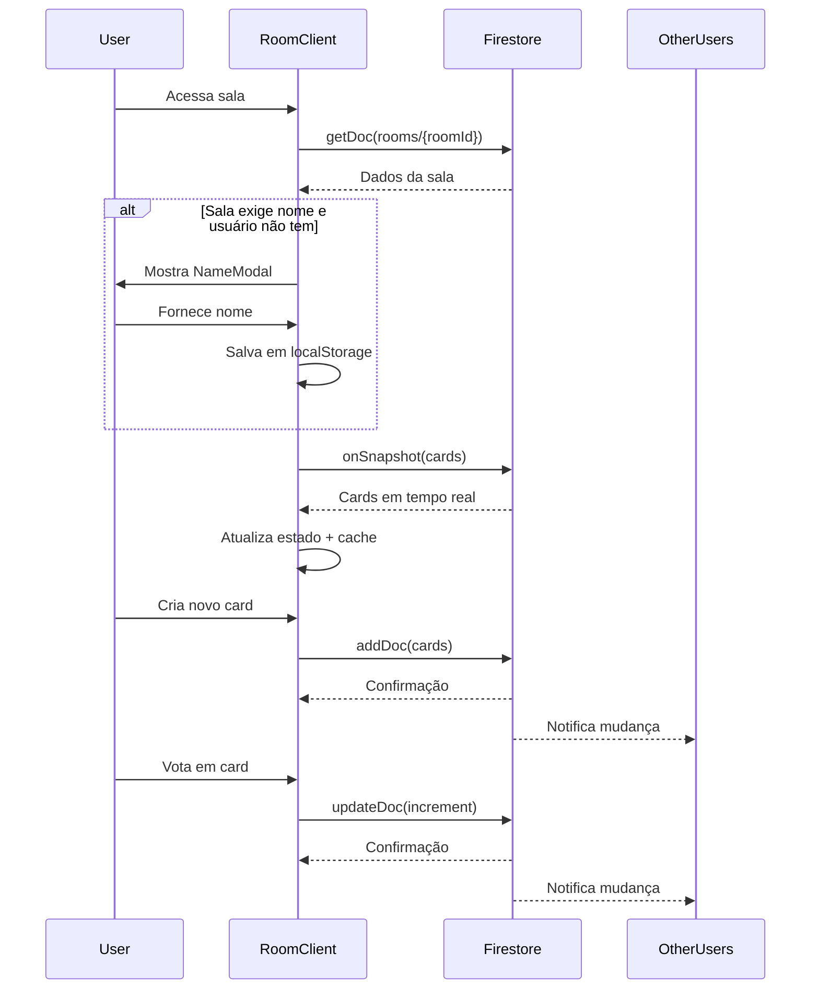

# Módulo Retrospectiva

**Versão:** 0.8.2  
**Última Atualização:** 2025-01-26

## Visão Geral

O módulo Retrospectiva permite criar salas colaborativas para reuniões de retrospectiva ágil, onde participantes podem adicionar cards em três categorias (bom, ruim, melhorar) e votar em tempo real usando Firebase Firestore.

### Características Principais

- **Salas Colaborativas:** Múltiplos usuários podem participar simultaneamente
- **Votação em Tempo Real:** Sistema de likes/dislikes com sincronização instantânea
- **Três Categorias:** Organização visual por tipo de feedback
- **Modo Anônimo:** Suporte opcional para participação sem identificação
- **Exportação:** Funcionalidade para exportar resultados

## Estrutura de Dados

### Tipo Room

```typescript
type Room = {
  id: string;
  name: string;
  createdBy: string;
  createdAt: Timestamp;
  allowAnonymous: boolean;
  isActive: boolean;
  requireName?: boolean;
  roomName?: string;
};
```

**Coleção Firestore:** `rooms`

**Campos:**
- `id`: Identificador único da sala (gerado pelo Firestore)
- `name`: Nome da sala (deprecated, usar `roomName`)
- `roomName`: Nome atual da sala
- `createdBy`: ID do usuário que criou a sala
- `createdAt`: Timestamp de criação
- `allowAnonymous`: Se permite participação anônima
- `isActive`: Se a sala está ativa
- `requireName`: Se exige nome do participante

### Tipo Card

```typescript
export type Card = {
  id: string;
  text: string;
  category: "bom" | "ruim" | "melhorar";
  likes: number;
  dislikes: number;
  author?: string;
};
```

**Coleção Firestore:** `rooms/{roomId}/cards` (subcoleção)

**Campos:**
- `id`: Identificador único do card
- `text`: Conteúdo do card
- `category`: Categoria do card (bom, ruim ou melhorar)
- `likes`: Número de votos positivos
- `dislikes`: Número de votos negativos
- `author`: Nome do autor (opcional, pode ser "Anônimo")

### Constantes de Categoria

```typescript
export const CATEGORY_COLORS: Record<Card["category"], string> = {
  bom: "bg-green-200",
  ruim: "bg-red-200",
  melhorar: "bg-yellow-200",
};

export const CATEGORIES = Object.keys(CATEGORY_COLORS) as Card["category"][];
```

## Componentes Principais

### RoomClient

**Arquivo:** `components/RoomClient.tsx`

Componente principal que gerencia a sala de retrospectiva.

**Props:**
```typescript
type Props = {
  roomId: string;
  locale: string;
};
```

**Responsabilidades:**
- Gerenciar estado da sala e cards
- Sincronizar dados em tempo real com Firestore
- Controlar modal de nome do usuário
- Implementar funcionalidade de compartilhamento
- Cache local de cards para melhor performance

**Exemplo de Uso:**
```typescript
// app/[locale]/room/[roomId]/page.tsx
import RoomClient from "@/components/RoomClient";

export default function RoomPage({ params }: { params: { roomId: string; locale: string } }) {
  return <RoomClient roomId={params.roomId} locale={params.locale} />;
}
```

### Board

**Arquivo:** `components/Board.tsx`

Componente que renderiza o quadro com as três colunas de categorias.

**Props:**
```typescript
type Props = {
  cards: Card[];
  addCard: (category: Card["category"], text: string) => Promise<void>;
  vote: (id: string, type: "likes" | "dislikes") => Promise<void>;
};
```

### Column

**Arquivo:** `components/Column.tsx`

Componente que representa uma coluna de categoria específica.

**Props:**
```typescript
type Props = {
  category: Card["category"];
  cards: Card[];
  addCard: (text: string) => void;
  vote: (id: string, type: "likes" | "dislikes") => void;
};
```

### CardItem

**Arquivo:** `components/CardItem.tsx`

Componente que renderiza um card individual com botões de votação.

**Props:**
```typescript
type Props = {
  card: Card;
  vote: (id: string, type: "likes" | "dislikes") => void;
};
```

### CreateCard

**Arquivo:** `components/CreateCard.tsx`

Componente de formulário para criar novos cards.

**Props:**
```typescript
type Props = {
  onSubmit: (text: string) => void;
};
```

## Operações CRUD

### Criar uma Sala

```typescript
import { collection, addDoc, serverTimestamp } from "firebase/firestore";
import { db } from "@/lib/firebase";

async function createRoom(
  name: string,
  createdBy: string,
  requireName: boolean = true
): Promise<string> {
  const roomData = {
    roomName: name,
    createdBy,
    createdAt: serverTimestamp(),
    allowAnonymous: !requireName,
    isActive: true,
    requireName,
  };
  
  const docRef = await addDoc(collection(db, "rooms"), roomData);
  return docRef.id;
}
```

### Buscar Dados da Sala

```typescript
import { doc, getDoc } from "firebase/firestore";
import { db } from "@/lib/firebase";

async function getRoom(roomId: string) {
  const snap = await getDoc(doc(db, "rooms", roomId));
  
  if (!snap.exists()) {
    return null;
  }
  
  const data = snap.data();
  return {
    id: snap.id,
    roomName: data.roomName || "Sala de Retrospectiva",
    requireName: data.requireName ?? true,
    allowAnonymous: data.allowAnonymous ?? false,
    isActive: data.isActive ?? true,
  };
}
```

### Criar um Card

```typescript
import { collection, addDoc, serverTimestamp } from "firebase/firestore";
import { db } from "@/lib/firebase";
import type { Card } from "@/types/card";

async function createCard(
  roomId: string,
  category: Card["category"],
  text: string,
  author?: string
): Promise<void> {
  if (!text.trim()) return;

  await addDoc(collection(db, "rooms", roomId, "cards"), {
    category,
    text: text.trim(),
    likes: 0,
    dislikes: 0,
    author: author || "Anônimo",
    createdAt: serverTimestamp(),
  });
}
```

### Escutar Cards em Tempo Real

```typescript
import { collection, query, onSnapshot } from "firebase/firestore";
import { db } from "@/lib/firebase";
import type { Card } from "@/types/card";

function subscribeToCards(
  roomId: string,
  callback: (cards: Card[]) => void
): () => void {
  const q = query(collection(db, "rooms", roomId, "cards"));

  const unsubscribe = onSnapshot(q, (snapshot) => {
    const cards = snapshot.docs.map(
      (doc) => ({ id: doc.id, ...doc.data() } as Card)
    );
    callback(cards);
  });

  return unsubscribe;
}

// Uso no componente
useEffect(() => {
  const unsubscribe = subscribeToCards(roomId, (cards) => {
    setCards(cards);
    // Cache local
    localStorage.setItem(`room:${roomId}:cards`, JSON.stringify(cards));
  });

  return () => unsubscribe();
}, [roomId]);
```

### Votar em um Card

```typescript
import { doc, updateDoc, increment } from "firebase/firestore";
import { db } from "@/lib/firebase";

async function voteCard(
  roomId: string,
  cardId: string,
  type: "likes" | "dislikes"
): Promise<void> {
  const cardRef = doc(db, "rooms", roomId, "cards", cardId);
  
  await updateDoc(cardRef, {
    [type]: increment(1)
  });
}
```

## Fluxo de Dados



## Cache Local

O módulo implementa cache local usando `localStorage` para melhorar a performance:

```typescript
// Carregar cache ao montar componente
useEffect(() => {
  const cached = localStorage.getItem(`room:${roomId}:cards`);
  if (cached) {
    setCards(JSON.parse(cached));
  }
}, [roomId]);

// Atualizar cache quando dados mudam
useEffect(() => {
  const q = query(collection(db, "rooms", roomId, "cards"));

  const unsubscribe = onSnapshot(q, (snapshot) => {
    const data = snapshot.docs.map(
      (d) => ({ id: d.id, ...d.data() } as Card)
    );

    setCards(data);
    localStorage.setItem(`room:${roomId}:cards`, JSON.stringify(data));
  });

  return () => unsubscribe();
}, [roomId]);
```

## Compartilhamento de Sala

### Via WhatsApp (Mobile)

```typescript
const shareRoom = () => {
  const roomUrl = `${window.location.origin}/${locale}/room/${roomId}`;
  const isMobile = /Android|iPhone|iPad|iPod/i.test(navigator.userAgent);
  
  if (isMobile) {
    const whatsappUrl = `https://wa.me/?text=${encodeURIComponent(
      `Participe da retrospectiva: ${roomUrl}`
    )}`;
    window.open(whatsappUrl);
  } else {
    navigator.clipboard.writeText(roomUrl);
    alert("Link copiado!");
  }
};
```

### Botão de Compartilhamento

```typescript
<button
  onClick={shareRoom}
  className="fixed bottom-6 right-6 p-4 rounded-full shadow-lg text-white bg-green-500 hover:bg-green-600 transition z-40"
>
  {isMobile ? (
    <FaWhatsapp className="text-2xl" />
  ) : (
    <FaCopy className="text-2xl" />
  )}
</button>
```

## Internacionalização

O módulo utiliza `next-intl` para suporte a múltiplos idiomas:

```typescript
// No componente
const t = useTranslations("Room");

// Uso
<h1>{t("title")}</h1>
<p>{t("defaults.anonymous")}</p>
```

**Chaves de Tradução Necessárias:**
```json
{
  "Room": {
    "title": "Retrospectiva",
    "defaults": {
      "roomName": "Sala de Retrospectiva",
      "anonymous": "Anônimo"
    },
    "share": {
      "whatsappUrl": "https://wa.me/?text={url}",
      "copied": "Link copiado!"
    }
  }
}
```

## Boas Práticas

### 1. Validação de Entrada

Sempre valide o texto antes de criar cards:

```typescript
const addCard = async (category: Card["category"], text: string) => {
  if (!text.trim()) return; // Não criar cards vazios
  
  await addDoc(collection(db, "rooms", roomId, "cards"), {
    category,
    text: text.trim(), // Remover espaços extras
    likes: 0,
    dislikes: 0,
    author: userName || t("defaults.anonymous"),
    createdAt: serverTimestamp(),
  });
};
```

### 2. Tratamento de Erros

```typescript
const addCard = async (category: Card["category"], text: string) => {
  try {
    if (!text.trim()) return;
    
    await addDoc(collection(db, "rooms", roomId, "cards"), {
      category,
      text: text.trim(),
      likes: 0,
      dislikes: 0,
      author: userName || t("defaults.anonymous"),
      createdAt: serverTimestamp(),
    });
  } catch (error) {
    console.error("Erro ao criar card:", error);
    alert("Erro ao criar card. Tente novamente.");
  }
};
```

### 3. Limpeza de Subscriptions

Sempre retorne a função de cleanup nos `useEffect`:

```typescript
useEffect(() => {
  const q = query(collection(db, "rooms", roomId, "cards"));
  
  const unsubscribe = onSnapshot(q, (snapshot) => {
    // ... processar dados
  });

  // IMPORTANTE: Limpar subscription ao desmontar
  return () => unsubscribe();
}, [roomId]);
```

### 4. Verificação de Sala Existente

```typescript
useEffect(() => {
  const fetchRoom = async () => {
    const snap = await getDoc(doc(db, "rooms", roomId));

    if (!snap.exists()) {
      // Redirecionar se sala não existe
      router.push(`/${locale}`);
      return;
    }

    // ... processar dados da sala
  };

  fetchRoom();
}, [roomId, locale, router]);
```

## Exportação de Resultados

O módulo inclui componente `ExportButtons` para exportar dados:

```typescript
import ExportButtons from "@/components/ExportButtons";

<ExportButtons 
  cards={cards} 
  title={roomData.roomName} 
/>
```

Funcionalidades de exportação:
- Exportar para PDF
- Exportar para Excel
- Exportar para imagem

## Segurança

### Regras do Firestore

```javascript
// firestore.rules
rules_version = '2';
service cloud.firestore {
  match /databases/{database}/documents {
    // Salas: qualquer um pode ler, apenas autenticados podem criar
    match /rooms/{roomId} {
      allow read: if true;
      allow create: if request.auth != null;
      allow update, delete: if request.auth != null && 
        resource.data.createdBy == request.auth.uid;
      
      // Cards: qualquer um pode ler e criar (suporte a anônimos)
      match /cards/{cardId} {
        allow read: if true;
        allow create: if true;
        allow update: if true; // Para votação
        allow delete: if request.auth != null;
      }
    }
  }
}
```

## Referências

- **Tipos:** `types/card.ts`
- **Componentes:** `components/RoomClient.tsx`, `components/Board.tsx`, `components/Column.tsx`, `components/CardItem.tsx`, `components/CreateCard.tsx`
- **Firebase:** `lib/firebase.ts`
- **Documentação Firebase:** [Firestore Real-time Updates](https://firebase.google.com/docs/firestore/query-data/listen)
